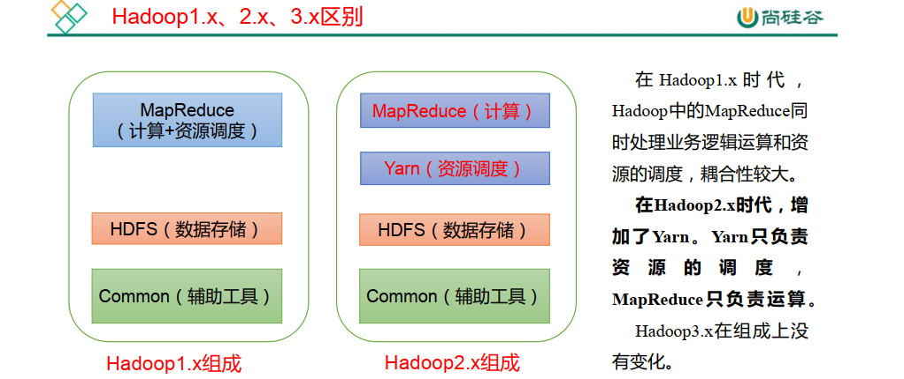
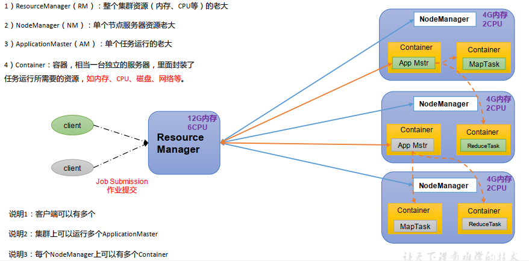
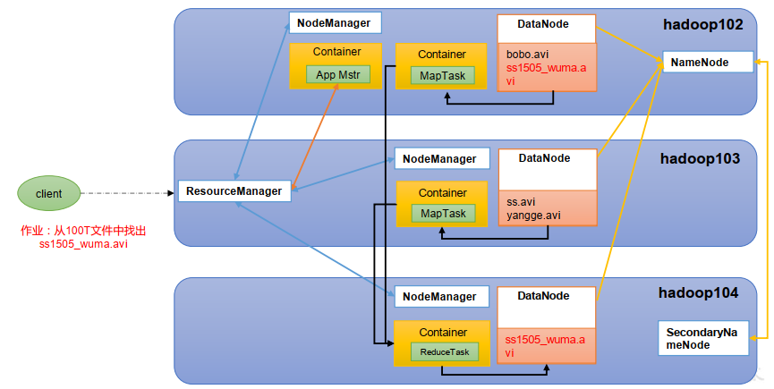
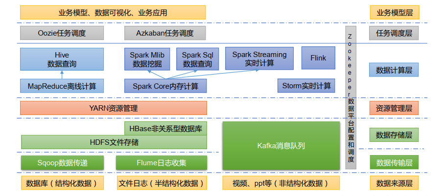
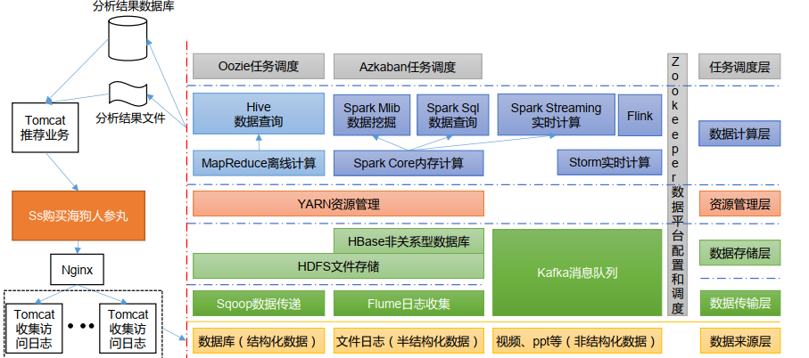

## Day1 开篇
**1.学习知识点**
Yarn Hadoop源码解析 入门 HDFS MapReduce 生产调优手册

从搭建集群开始

基础:java maven idea linux 常用命令

## Day2 大数据的概念
**1.大数据概念**
无法在一定时间范围内用常规软件进行捕捉、管理和处理的数据集合，需要用新处理模式才能有更强的决策力。
例如电脑磁盘只有1T，我有5T的数据需要存储，因此要用大数据。

按顺序给出不数据存储单位：bit Byte KB MB GB TB PB EB ZB YB BB NB DB 

**2. 大数据解决**
海量数据的采集、存储和分析计算问题

## Day3 大数据的特点
1. 大量 Volume 1PB = 1024TB：企业级数据已经将近EB 需要海量的数据集群进行存储：
**用海量数据的存储解决**
2. 高速 Velocity 
**用大数据快速计算解决**
3. 多样 海量数据的采集问题 
结构化数据：mysql
非结构化数据：网页
**用海量数据的采集解决**
4. 低价值密度 Value 价值密度高度与数据总量的大小成反比
快速对有价值的数据提纯

**对大数据采集后的清洗**

## Day4 大数据的应用场景
1. 抖音推荐
2. 电商广告推荐
3. 零售 分析用户消费习惯 为用户购买商品提供方便
4. 物流仓储：京东物流次日到达 哪个地点的物流存什么物品
5. 保险 
6. 金融：帮助金融机构推荐优质客户 
7. 房产
8. 人工智能+5G+互联网+虚拟与现实

## Day5 大数据发展场景
互联网 大数据 人工智能与实体经济融合

## Day6 大数据未来的工作内容
产品人员提需求-->数据部门搭建数据平台、分析数据指标--->数据可视化

大数据部门：
平台组（平台的搭建、集群性能监控、集群性能调优）
数据仓库组（数据清洗、ETL数据清洗、数据分析数据仓库建模）
实时组（实时分析性能调优）
数据挖掘组（算法组、推荐系统工程师、用户画像工程师）
报表开发组（JavaEE、前端工程师）

## Day7 Hadoop入门
1. 概念：Hadoop是什么 发展历史 三大发行版本 优势 组成 大数据技术生态体系 推荐系统案例
2. 环境准备： 模板虚拟机准备 克隆 安装JDK、Hadoop
3. Hadoop生产集群搭建 ：本地模式（测试） **完全分布式集群（开发面试的重点）**
4. 常见错误解决方案

## Day7 Hadoop是什么
1. Apache基金会开发的分布式系统基础架构
分布式：一个资料用多台服务器来处理或存储

**2. 主要解决海量数据的存储和海量数据的分析计算**

3. Hadoop生态圈

## Day9 Hadoop发展历史
三个框架
HDFS 
MR
HBase

## Day10 Hadoop三大发行版本
Apache 
Cloudera 
Hortonworks

## Day11 Hadoop优势
高可靠性
高扩展性（动态增加、删除服务器）
高效性（Hadoop并行工作）
高容错性：可自动将失败的任务重新分配

## Day12 Hadoop的组成
资源调度：分配那个服务器、内存

## Day13 HDFS概述 Hadoop分布式文件系统
NameNode：数据存储在什么位置 目录
DataNode（服务器）：具体存储的数据 根据NameNode去寻找
2NN：NameNode的备份 防止目录丢失错误

## Day14 YARN架构概述
资源管理器：ResourceManager：

其中Container容器就是将大的服务器NodeManager虚构出来，当做一个服务器。不需要的时候就将其释放到NodeManger。如阿里云。

ApplicationMaster的任务可以跨节点，跨NodeManger服务器。

Container容器默认1-8G。

## Day15 MapReduce架构概述
1. MapReduce将计算过程分为两个阶段：MaP和Reduce
>Map结算并行处理输入数据。
Reduce阶段对Map结果进行汇总

2. 任务分给每个Hadoop（Map）->每个Hadoop计算结果->返回结果（reduce）

## Day16 HDFS、Yarn、MapReduce三者之间的关系

## Day17 大数据技术生态体系
结构化数据：数据库 二维表格  -->用sqoop数据传递
半结构化数据：文件日志 可以导入到数据库 -->用Flume日志收集
非结构化数据：视频 ppt -->用Kafka消息队列处理（同时kafka也可以处理上述两种）

任务调度：集群中100多个任务，不一定同时跑，一部分执行完，下一批执行
任务调度的方法：Oozie任务调度 Azkaban任务调度

大数据闭环：首先根据浏览网页的，然后收集日志，存入文件日志，通过Flume日志收集，然后给Kalfka消息队列，通过Spark Streaming或Flink实时计算，下一次推荐给他什么东西。然后存入数据库，通过JavaEE后台进行后端操作，左后显示在前端推荐页面上。

## Day18 模板虚拟机准备
模板虚拟机的作用是为了生成多台服务器
配置内存4g\硬盘50g\IP\主机名称

软件、硬件、主机名称