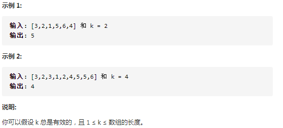
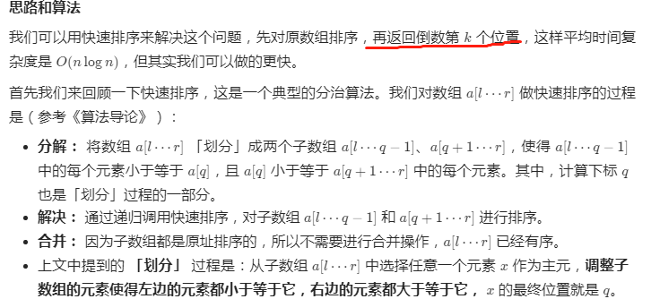
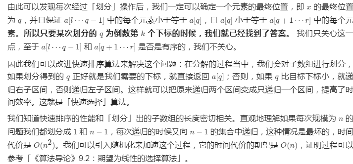

## 1 快速排序的变型
215题：在未排序的数组中找到第 k 个最大的元素。请注意，你需要找的是数组排序后的第 k 个最大的元素，而不是第 k 个不同的元素。

 
 题解：
 
 
 其中第k大元素，在排好序的数组中，为nums.length-k的索引的位置。

 ```java
public class QuickSelect {
    public static void  main(String[] args){
        Scanner in = new Scanner(System.in);
        Solution solution = new Solution();
        int res;
        int i = 0;
        int target;
        target = in.nextInt();
        ArrayList<Integer> list = new ArrayList<>();
        while (!in.hasNext("99")){//输入99时终止输入
            list.add(i,in.nextInt());
            i++;
        }

        //arraylist转换为数组
        int[] d = new int[list.size()];
        for(int j = 0;j<list.size();j++){
            d[j] = list.get(j);
        }
        res = solution.findKthLargest(d,target);
        System.out.println(res);
    }
}
class Solution {
    public int findKthLargest(int[] nums, int k) {
        return quickSort(nums,0,nums.length-1,nums.length-k);
    }

    public int quickSort(int a[],int left,int right,int index){
        int q = partition(a,left,right);
        if(q == index){
            return a[q];
        }else {
            return q<index ? quickSort(a,q+1,right,index):quickSort(a,left,q-1,index);
        }
    }

    public int partition(int a[],int left,int right){
        int pivotKey;

        //中枢取三中
        int m = (left + right)/2;
        if(a[left]>a[right]){
            swap(a,left,right);
        }
        if(a[m]>a[right]){
            swap(a,m,right);
        }
        if(a[m]>a[left]){
            swap(a,left,m);
        }

        pivotKey = a[left];

        while(left<right){
            while(left<right && a[right]>=pivotKey){
                right--;
            }
            a[left] = a[right];
            while(left<right && a[left]<=pivotKey){
                left++;
            }
            a[right] = a[left];
        }
        a[left] = pivotKey;
        return left;
    }
    //交换两个数组的值
    public void swap(int a[],int i,int j){
        int temp = a[i];
        a[i] = a[j];
        a[j] = temp;
    }
}
 ```