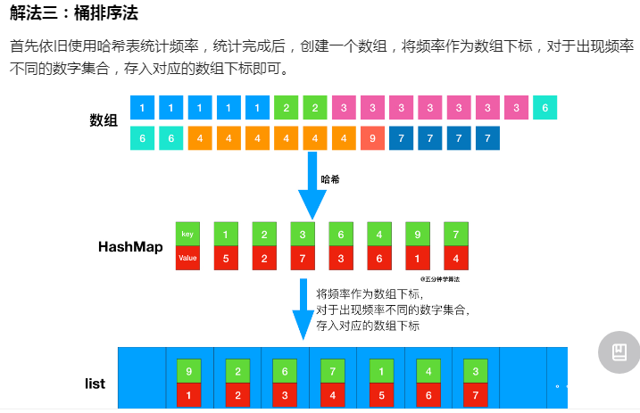

## 1 快速排序的变型
215题：在未排序的数组中找到第 k 个最大的元素。请注意，你需要找的是数组排序后的第 k 个最大的元素，而不是第 k 个不同的元素。

 
 题解：
 
 
 其中第k大元素，在排好序的数组中，为nums.length-k的索引的位置。

 ```java
public class QuickSelect {
    public static void  main(String[] args){
        Scanner in = new Scanner(System.in);
        Solution solution = new Solution();
        int res;
        int i = 0;
        int target;
        target = in.nextInt();
        ArrayList<Integer> list = new ArrayList<>();
        while (!in.hasNext("99")){//输入99时终止输入
            list.add(i,in.nextInt());
            i++;
        }

        //arraylist转换为数组
        int[] d = new int[list.size()];
        for(int j = 0;j<list.size();j++){
            d[j] = list.get(j);
        }
        res = solution.findKthLargest(d,target);
        System.out.println(res);
    }
}
class Solution {
    public int findKthLargest(int[] nums, int k) {
        return quickSort(nums,0,nums.length-1,nums.length-k);
    }

    public int quickSort(int a[],int left,int right,int index){
        int q = partition(a,left,right);
        if(q == index){
            return a[q];
        }else {
            return q<index ? quickSort(a,q+1,right,index):quickSort(a,left,q-1,index);
        }
    }

    public int partition(int a[],int left,int right){
        int pivotKey;

        //中枢取三中
        int m = (left + right)/2;
        if(a[left]>a[right]){
            swap(a,left,right);
        }
        if(a[m]>a[right]){
            swap(a,m,right);
        }
        if(a[m]>a[left]){
            swap(a,left,m);
        }

        pivotKey = a[left];

        while(left<right){
            while(left<right && a[right]>=pivotKey){
                right--;
            }
            a[left] = a[right];
            while(left<right && a[left]<=pivotKey){
                left++;
            }
            a[right] = a[left];
        }
        a[left] = pivotKey;
        return left;
    }
    //交换两个数组的值
    public void swap(int a[],int i,int j){
        int temp = a[i];
        a[i] = a[j];
        a[j] = temp;
    }
}
 ```

 ## 2. 347前k个高频元素
### 方法1 桶排序

```java
package TongSort;

import java.util.*;

public class TopKTongSort {
    public static void main(String[] args){
        Solution solution = new Solution();
        Scanner in = new Scanner(System.in);
//        List<Integer> res = new ArrayList<>();
        int[] res = new int[0];
        int i = 0;
        int target;
        ArrayList<Integer> list = new ArrayList<>();
        target = in.nextInt();
        while (!in.hasNext("99")){//输入99时终止输入
            list.add(i,in.nextInt());
            i++;
        }

        //arraylist转换为数组
        int[] d = new int[list.size()];
        for(int j = 0;j<list.size();j++){
            d[j] = list.get(j);
        }
        res = solution.topKFrequent(d,target);
        String string = Arrays.toString(res);
        System.out.println(string);
    }
}

class Solution{
    public int[] topKFrequent(int[] nums, int k) {
        int numsLen = nums.length;
        Map<Integer,Integer> map = new HashMap<>();
        List<Integer> resList = new ArrayList<>();
        if(numsLen == 0){
            return new int[0];
        }
        //将出现的频率存入Hash表中 key value
        for (int num : nums) {
            if(map.containsKey(num)){
                map.put(num,map.get(num)+1);
            }else {
                map.put(num,1);
            }
            //map.put(num,map.getOrDefault(num,0)+1);//也可以将上述if else替换为此
        }

        //将频率作为数组下标 因为下面i至少为1(map中key的频率至少为1) 所以下面将list初始化大小为numsLen+1
        List<Integer>[] list = new List[numsLen+1];

        for (int key : map.keySet()) {
            int i = map.get(key);
            if(list[i] == null){
                list[i] = new ArrayList<>();
            }
            list[i].add(key);
        }

        //按数组索引倒序返回值 前k多的
        for(int i = list.length-1;i>=0 && resList.size()<k;i--){
            if(list[i] == null){
                continue;
            }
            resList.addAll(list[i]);
        }

        //将list转换为数组
        int[] arr = new int[resList.size()];
        for(int j = 0;j<resList.size();j++){
            arr[j] = resList.get(j);
        }

        return arr;
    }
}
```

### 方法2 堆排序

 首先遍历整个数组，并使用哈希表记录每个数字出现的次数，并形成一个「出现次数数组」。找出原数组的前 kk 个高频元素，就相当于找出「出现次数数组」的前 kk 大的值。

最简单的做法是给「出现次数数组」排序。但由于可能有 O(N)O(N) 个不同的出现次数（其中 NN 为原数组长度），故总的算法复杂度会达到 O(N\log N)O(NlogN)，不满足题目的要求。

在这里，我们可以利用堆的思想：建立一个小顶堆，然后遍历「出现次数数组」：

如果堆的元素个数小于 kk，就可以直接插入堆中。
如果堆的元素个数等于 kk，则检查堆顶与当前出现次数的大小。如果堆顶更大，说明至少有 kk 个数字的出现次数比当前值大，故舍弃当前值；否则，就弹出堆顶，并将当前值插入堆中。
遍历完成后，堆中的元素就代表了「出现次数数组」中前 kk 大的值。

```java
class Solution {
    public int[] topKFrequent(int[] nums, int k) {
        Map<Integer, Integer> occurrences = new HashMap<Integer, Integer>();
        for (int num : nums) {
            occurrences.put(num, occurrences.getOrDefault(num, 0) + 1);
        }

        // int[] 的第一个元素代表数组的值，第二个元素代表了该值出现的次数
        PriorityQueue<int[]> queue = new PriorityQueue<int[]>(new Comparator<int[]>() {
            public int compare(int[] m, int[] n) {
                return m[1] - n[1];
            }
        });
        for (Map.Entry<Integer, Integer> entry : occurrences.entrySet()) {
            int num = entry.getKey(), count = entry.getValue();
            if (queue.size() == k) {
                if (queue.peek()[1] < count) {
                    queue.poll();
                    queue.offer(new int[]{num, count});
                }
            } else {
                queue.offer(new int[]{num, count});
            }
        }
        int[] ret = new int[k];
        for (int i = 0; i < k; ++i) {
            ret[i] = queue.poll()[0];
        }
        return ret;
    }
}
```
