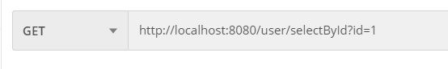
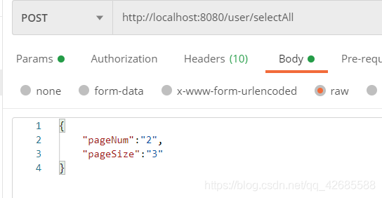

1. @GetMapping：
直接从URL获得数据，以`www.xxx.com/?id=1`类似这种形式传输。
举例：

这个URL中，请求来到后端，并且是一个`Get`方法，那么`selectById`就会接受到一个`id=1`这样的参数

2. @PostMapping
请求会从`body`部分拿到数据，好处是一些不希望用户看到的数据会放在body里面传输。
举例

这个`post`方法，`pageNum`和`pageSize`数据都在`body`里面而不是在`url`里