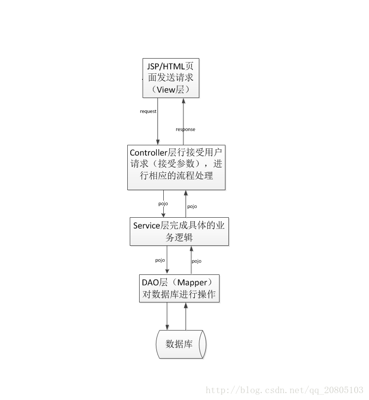

最近工作中开发的项目使用了Spring-springMVC-Mybatis框架进行开发，今天来总结写这段时间对SSM框架的理解。在对SSM框架整合前，先对框架的每层的作用以及它们之间的关系做一个简单的介绍。

## 一、SSM框架中各层级间的作用及关系
表现层（springMVC）：Controller层（Handler层）

### 1. 负责具体的业务模块流程的控制
1. Controller层通过要调用Service层的接口来控制业务流程，控制的
配置也在Spring配置文件里面。
业务层（Spring）：Service层

2. Service层：负责业务模块的逻辑应用设计。
首先设计其接口，然后再实现他的实现类。
通过对Spring配置文件中配置其实现的关联，完成此步工作，我们
就可以通过调用Service的接口来进行业务处理。
最后通过调用DAO层已定义的接口，去实现Service具体的 实现类。
持久层（Mybatis）：Dao层（Mapper层）

3. Dao层：负责与数据库进行交互设计，用来处理数据的持久化工作。
DAO层的设计首先是设计DAO的接口，
然后在Spring的配置文件中定义此接口的实现类，就可在其他模块中
调用此接口来进行数据业务的处理，而不用关心接口的具体实现类是
哪个类，这里用到的就是反射机制， DAO层的数据源配置，以及有
关数据库连接的参数都在Spring的配置文件中进行配置。

4. 视图层：View层
负责前台jsp页面的展示。
此层需要与Controller层结合起来开发。
各层间的联系：

本来Controller层与View层是可以放在.jsp文件里一起开发的，但是为了降低代码的复杂度，提高其可维护性，将其分为了这两层，这也体现了MVC框架的特性，即结构清晰，耦合度低。
Service层是建立在DAO层之上的，建立了DAO层后才可以建立Service层，而Service层又是在Controller层之下的，因而Service层应该既调用DAO层的接口，又要提供接口给Controller层的类来进行调用，它刚好处于一个中间层的位置。每个模型都有一个Service接口，每个接口分别封装各自的业务处理方法。

## 二、SSM框架整合说明
这里有一篇总结的详细的博文，大家可以参考着这位博主的来理解。
博文链接:[SSM框架整合说明](http://blog.csdn.net/zhshulin/article/details/37956105)  

## 三、层架构运行流程

