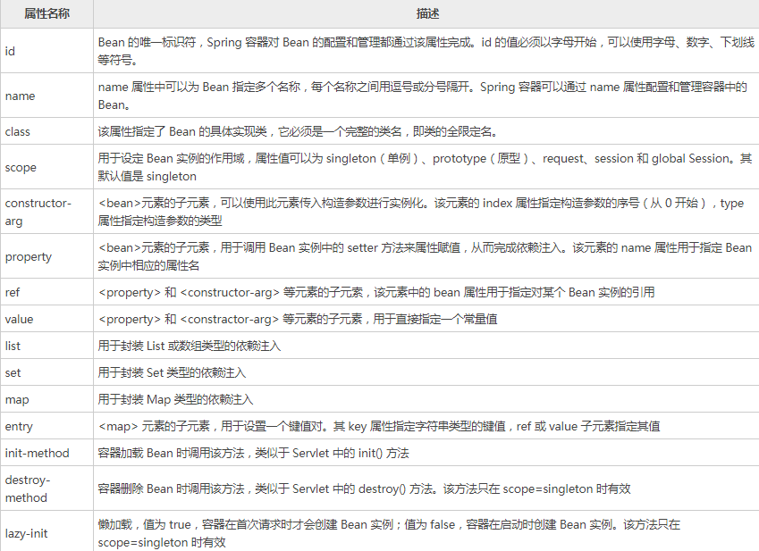

转自：[Spring](http://c.biancheng.net/spring/what-is-spring.html) 
## springmvc和springboot的区别
Spring 框架就像一个家族，有众多衍生产品例如 boot、security、jpa等等。但他们的基础都是Spring 的 ioc和 aop ioc 提供了依赖注入的容器 aop ，解决了面向横切面的编程，然后在此两者的基础上实现了其他延伸产品的高级功能。Spring MVC是基于 Servlet 的一个 MVC 框架 主要解决 WEB 开发的问题，因为 Spring 的配置非常复杂，各种XML、 JavaConfig、hin处理起来比较繁琐。于是为了简化开发者的使用，从而创造性地推出了Spring boot，约定优于配置，简化了spring的配置流程。

说得更简便一些：Spring 最初利用“工厂模式”（DI）和“代理模式”（AOP）解耦应用组件。大家觉得挺好用，于是按照这种模式搞了一个 MVC框架（一些用Spring 解耦的组件），用开发 web 应用（ SpringMVC ）。然后有发现每次开发都写很多样板代码，为了简化工作流程，于是开发出了一些“懒人整合包”（starter），这套就是 Spring Boot。

 

### 1.Spring MVC的功能

Spring MVC提供了一种轻度耦合的方式来开发web应用。

Spring MVC是Spring的一个模块，式一个web框架。通过Dispatcher Servlet, ModelAndView 和 View Resolver，开发web应用变得很容易。解决的问题领域是网站应用程序或者服务开发——URL路由、Session、模板引擎、静态Web资源等等。

 

### 2. Spring Boot的功能

Spring Boot实现了自动配置，降低了项目搭建的复杂度。

众所周知Spring框架需要进行大量的配置，Spring Boot引入自动配置的概念，让项目设置变得很容易。Spring Boot本身并不提供Spring框架的核心特性以及扩展功能，只是用于快速、敏捷地开发新一代基于Spring框架的应用程序。也就是说，它并不是用来替代Spring的解决方案，而是和Spring框架紧密结合用于提升Spring开发者体验的工具。同时它集成了大量常用的第三方库配置(例如Jackson, JDBC, Mongo, Redis, Mail等等)，Spring Boot应用中这些第三方库几乎可以零配置的开箱即用(out-of-the-box)，大部分的Spring Boot应用都只需要非常少量的配置代码，开发者能够更加专注于业务逻辑。

Spring Boot只是承载者，辅助你简化项目搭建过程的。如果承载的是WEB项目，使用Spring MVC作为MVC框架，那么工作流程和你上面描述的是完全一样的，因为这部分工作是Spring MVC做的而不是Spring Boot。

对使用者来说，换用Spring Boot以后，项目初始化方法变了，配置文件变了，另外就是不需要单独安装Tomcat这类容器服务器了，maven打出jar包直接跑起来就是个网站，但你最核心的业务逻辑实现与业务流程实现没有任何变化。

### 3. 所以，用最简练的语言概括就是：

Spring 是一个“引擎”；

Spring MVC 是基于Spring的一个 MVC 框架 ；

Spring Boot 是基于Spring4的条件注册的一套快速开发整合包。

## 一 Spring 是什么

### 1. Spring 全家桶
Spring包括许多框架，例如 Spring framework、SpringMVC、SpringBoot、Spring Cloud、Spring Data、Spring Security 等，所以有人将它们亲切的称之为：Spring 全家桶。

### 2. Spring framework
Spring framework 就是我们平时说的 Spring 框架，本套教程我们将 Spring framework 简称为 Spring 框架。Spring 框架是全家桶内其它框架的基础和核心，下面让我们来认识 Spring 框架吧。

### 3. Spring
Spring 是目前主流的 Java Web 开发框架，是 Java 世界最为成功的框架。该框架是一个轻量级的开源框架，具有很高的凝聚力和吸引力。

Spring 由 Rod Johnson 创立，2004 年发布了 Spring 框架的第一版，其目的是用于简化企业级应用程序开发的难度和周期。

### 4. IoC与AOP
Spring 是分层的 Java SE/EE 一站式轻量级开源框架，以 IoC（Inverse of Control，控制反转）和 AOP（Aspect Oriented Programming，面向切面编程）为内核。

#### 4.1 IOC
IoC 指的是将对象的创建权交给 Spring 去创建。使用 Spring 之前，对象的创建都是由我们使用 new 创建，而使用 Spring 之后，对象的创建都交给了 Spring 框架。
### 4.2 AOP
AOP 用来封装多个类的公共行为，将那些与业务无关，却为业务模块所共同调用的逻辑封装起来，减少系统的重复代码，降低模块间的耦合度。另外，AOP 还解决一些系统层面上的问题，比如日志、事务、权限等。

### 5 Bean
在 Spring 中，认为一切 Java 类都是资源，而资源都是类的实例对象（Bean），容纳并管理这些 Bean 的是 Spring 所提供的 IoC 容器，所以 Spring 是一种基于 Bean 的编程，它深刻地改变着 Java 开发世界，使用基本的 JavaBean 来完成以前只有 EJB 才能完成的工作，使得很多复杂的代码变得优雅和简洁，避免了 EJB 臃肿、低效的开发模式，极大的方便项目的后期维护、升级和扩展。迅速地取代 EJB 成为了实际的开发标准。


### 6 三层体系架构
在实际开发中，服务器端通常采用三层体系架构，分别为表现层（web）、业务逻辑层（service）、持久层（dao）。

Spring 致力于 Java EE 应用各层的解决方案，对每一层都提供了技术支持。在表现层提供了与 Spring MVC、Struts2 框架的整合，在业务逻辑层可以管理事务和记录日志等，在持久层可以整合 MyBatis、Hibernate 和 JdbcTemplate 等技术。这就充分体现出 Spring 是一个全面的解决方案，对于已经有较好解决方案的领域，Spring 绝不做重复的事情。


Spring 作为实现 Java EE 的一个全方位应用程序框架，为开发企业级应用提供了一个健壮、高效的解决方案。它不仅可以应用于服务器端开发，也可应用于任何 Java 应用的开发。

### 7 Spring 框架具有以下几个特点。
1. 方便解耦，简化开发
Spring 就是一个大工厂，可以将所有对象的创建和依赖关系的维护交给 Spring 管理。
2. 方便集成各种优秀框架
Spring 不排斥各种优秀的开源框架，其内部提供了对各种优秀框架（如 Struts2、Hibernate、MyBatis 等）的直接支持。
3. 降低 Java EE API 的使用难度
Spring 对 Java EE 开发中非常难用的一些 API（JDBC、JavaMail、远程调用等）都提供了封装，使这些 API 应用的难度大大降低。
4. 方便程序的测试
Spring 支持 JUnit4，可以通过注解方便地测试 Spring 程序。
5. AOP 编程的支持
Spring 提供面向切面编程，可以方便地实现对程序进行权限拦截和运行监控等功能。
6. 声明式事务的支持
只需要通过配置就可以完成对事务的管理，而无须手动编程。

---

## 二 Spring体系结构
Spring 框架采用分层的理念，根据功能的不同划分成了多个模块，这些模块大体可分为 Data Access/Integration（数据访问与集成）、Web、AOP、Aspects、Instrumentation（检测）、Messaging（消息处理）、Core Container（核心容器）和 Test。如下图所示（以下是 Spring Framework 4.x 版本后的系统架构图）。

  

**1. Data Access/Integration（数据访问／集成）**
数据访问／集成层包括 JDBC、ORM、OXM、JMS 和 Transactions 模块，具体介绍如下。
**1.1 JDBC 模块：** 提供了一个 JBDC 的样例模板，使用这些模板能消除传统冗长的 JDBC 编码还有必须的事务控制，而且能享受到 Spring 管理事务的好处。
**1.2ORM 模块：** 提供与流行的“对象-关系”映射框架无缝集成的 API，包括 JPA、JDO、Hibernate 和 MyBatis 等。而且还可以使用 Spring 事务管理，无需额外控制事务。
**1.3 OXM 模块：** 提供了一个支持 Object /XML 映射的抽象层实现，如 JAXB、Castor、XMLBeans、JiBX 和 XStream。将 Java 对象映射成 XML 数据，或者将XML 数据映射成 Java 对象。
**1.4 JMS 模块：** 指 Java 消息服务，提供一套 “消息生产者、消息消费者”模板用于更加简单的使用 JMS，JMS 用于用于在两个应用程序之间，或分布式系统中发送消息，进行异步通信。
**1.5 Transactions 事务模块：** 支持编程和声明式事务管理。

**2. Web模块**
Spring 的 Web 层包括 Web、Servlet、WebSocket 和 Portlet 组件，具体介绍如下。
**2.1 Web 模块：** 提供了基本的 Web 开发集成特性，例如多文件上传功能、使用的 Servlet 监听器的 IOC 容器初始化以及 Web 应用上下文。
**2.2 Servlet 模块：** 提供了一个 Spring MVC Web 框架实现。Spring MVC 框架提供了基于注解的请求资源注入、更简单的数据绑定、数据验证等及一套非常易用的 JSP 标签，完全无缝与 Spring 其他技术协作。
**2.3 WebSocket 模块：** 提供了简单的接口，用户只要实现响应的接口就可以快速的搭建 WebSocket Server，从而实现双向通讯。
**2.4 Portlet 模块：** 提供了在 Portlet 环境中使用 MVC 实现，类似 Web-Servlet 模块的功能。

**3. Core Container（Spring的核心容器）**
Spring 的核心容器是其他模块建立的基础，由 Beans 模块、Core 核心模块、Context 上下文模块和 SpEL 表达式语言模块组成，没有这些核心容器，也不可能有 AOP、Web 等上层的功能。具体介绍如下。
**3.1 Beans 模块：** 提供了框架的基础部分，包括控制反转和依赖注入。
**3.2 Core 核心模块：** 封装了 Spring 框架的底层部分，包括资源访问、类型转换及一些常用工具类。
**3.3 Context 上下文模块：** 建立在 Core 和 Beans 模块的基础之上，集成 Beans 模块功能并添加资源绑定、数据验证、国际化、Java EE 支持、容器生命周期、事件传播等。ApplicationContext 接口是上下文模块的焦点。
**3.4 SpEL 模块：** 提供了强大的表达式语言支持，支持访问和修改属性值，方法调用，支持访问及修改数组、容器和索引器，命名变量，支持算数和逻辑运算，支持从 Spring 容器获取 Bean，它也支持列表投影、选择和一般的列表聚合等。

**4. AOP、Aspects、Instrumentation和Messaging**
在 Core Container 之上是 AOP、Aspects 等模块，具体介绍如下：
**4.1 AOP 模块：** 提供了面向切面编程实现，提供比如日志记录、权限控制、性能统计等通用功能和业务逻辑分离的技术，并且能动态的把这些功能添加到需要的代码中，这样各司其职，降低业务逻辑和通用功能的耦合。
**4.2 Aspects 模块：** 提供与 AspectJ 的集成，是一个功能强大且成熟的面向切面编程（AOP）框架。
**4.3 Instrumentation 模块：** 提供了类工具的支持和类加载器的实现，可以在特定的应用服务器中使用。
**4.4 messaging 模块：** Spring 4.0 以后新增了消息（Spring-messaging）模块，该模块提供了对消息传递体系结构和协议的支持。
**5. Test模块**
Test 模块：Spring 支持 Junit 和 TestNG 测试框架，而且还额外提供了一些基于 Spring 的测试功能，比如在测试 Web 框架时，模拟 Http 请求的功能。  

---

## 三 第一个Spring程序
参考：[Idea创建maven spring程序](https://blog.csdn.net/jiahanghacker/article/details/88871207)  
 ### 1. 创建步骤
 
 首先Pom.xml引入相关依赖
 ```xml
 <?xml version="1.0" encoding="UTF-8"?>
<project xmlns="http://maven.apache.org/POM/4.0.0"
         xmlns:xsi="http://www.w3.org/2001/XMLSchema-instance"
         xsi:schemaLocation="http://maven.apache.org/POM/4.0.0 http://maven.apache.org/xsd/maven-4.0.0.xsd">
    <modelVersion>4.0.0</modelVersion>

    <groupId>com.spring.demo</groupId>
    <artifactId>springTest</artifactId>
    <version>1.0-SNAPSHOT</version>

    <dependencies>
        <!--测试相关-->
        <dependency>
            <groupId>junit</groupId>
            <artifactId>junit</artifactId>
            <version>4.11</version>
            <scope>test</scope>
        </dependency>
        <!--Spring核心基础依赖-->
        <dependency>
            <groupId>org.springframework</groupId>
            <artifactId>spring-core</artifactId>
            <version>5.2.3.RELEASE</version>
        </dependency>
        <dependency>
            <groupId>org.springframework</groupId>
            <artifactId>spring-context</artifactId>
            <version>5.2.3.RELEASE</version>
        </dependency>
        <dependency>
            <groupId>org.springframework</groupId>
            <artifactId>spring-beans</artifactId>
            <version>5.2.3.RELEASE</version>
        </dependency>
        <dependency>
            <groupId>org.springframework</groupId>
            <artifactId>spring-expression</artifactId>
            <version>5.2.3.RELEASE</version>
        </dependency>
        <!--日志相关-->
        <dependency>
            <groupId>commons-logging</groupId>
            <artifactId>commons-logging</artifactId>
            <version>1.2</version>
        </dependency>
        <dependency>
            <groupId>log4j</groupId>
            <artifactId>log4j</artifactId>
            <version>1.2.17</version>
        </dependency>
        <dependency>
            <groupId>org.testng</groupId>
            <artifactId>testng</artifactId>
            <version>RELEASE</version>
            <scope>compile</scope>
        </dependency>

    </dependencies>
</project>
```

1. Idea中new project->maven->然后填写next就可以

2. 在java目录下创建上图的net包，然后穿件HelloWorld.java和MainApp.java.
在resources中创建Beans.xml

其中：HelloWorld
```java
public class HelloWorld {
    private String message;

    public void setMessage(String message) {
        this.message = message;
    }

    public void getMessage() {
        System.out.println("message : " + message);
    }
}

```
MainApp
```java
import org.springframework.context.ApplicationContext;
import org.springframework.context.support.ClassPathXmlApplicationContext;
public class MainApp {
        public static void main(String[] args) {
            ApplicationContext context = new ClassPathXmlApplicationContext("Beans.xml");
            HelloWorld obj = (HelloWorld) context.getBean("helloWorld");
            obj.getMessage();
        }
}
```
关于以上代码，需要注意以下两点：
创建 ApplicationContext 对象时，我们使用了 ClassPathXmlApplicationContext 类。该类用于加载 Spring 配置文件、创建和初始化所有对象，也就是下面配置文件中提到的 Bean。
ApplicationContext.getBean() 方法用来获取 Bean，该方法返回值类型为 Object，通过强制类型转换为 HelloWorld 的实例对象，根据该对象调用类中的方法。
Beans.xml
```xml
<?xml version="1.0" encoding="UTF-8"?>
<beans xmlns="http://www.springframework.org/schema/beans"
       xmlns:xsi="http://www.w3.org/2001/XMLSchema-instance"
       xsi:schemaLocation="http://www.springframework.org/schema/beans
   http://www.springframework.org/schema/beans/spring-beans-3.0.xsd">

    <bean id="helloWorld" class="net.biancheng.HelloWorld">
        <property name="message" value="Hello World!" />
    </bean>

</beans>
```
也可以将该配置文件命名为其它有效的名称。需要注意的是，该文件名必须与 MainApp.java 中读取的配置文件名称一致。

Beans.xml 用于给不同的 Bean 分配唯一的 ID，并给相应的 Bean 属性赋值。例如，在以上代码中，我们可以在不影响其它类的情况下，给 message 变量赋值。


**问题：对于出现Error:java: 错误: 不支持发行版本 5**
解决办法：[java 5错误](https://blog.csdn.net/qq_22076345/article/details/82392236)
将projectStructure和setting中的jdk11换为jdk8  

---


## 四 IOC容器
**IoC 容器是 Spring 的核心，也可以称为 Spring 容器。Spring 通过 IoC 容器来管理对象的实例化和初始化，以及对象从创建到销毁的整个生命周期。**

**Spring 中使用的对象都由 IoC 容器管理，不需要我们手动使用 new 运算符创建对象。由 IoC 容器管理的对象称为 Spring Bean，Spring Bean 就是 Java 对象，和使用 new 运算符创建的对象没有区别。**

Spring 通过读取 XML 或 Java 注解中的信息来获取哪些对象需要实例化。

Spring 提供 2 种不同类型的 IoC 容器，即 `BeanFactory` 和 `ApplicationContext `容器。

### 1. BeanFactory 容器
BeanFactory 是最简单的容器，由 org.springframework.beans.factory.BeanFactory 接口定义，采用懒加载（lazy-load），所以容器启动比较快。BeanFactory 提供了容器最基本的功能。

为了能够兼容 Spring 集成的第三方框架（如 BeanFactoryAware、InitializingBean、DisposableBean），所以目前仍然保留了该接口。

简单来说，**BeanFactory 就是一个管理 Bean 的工厂，它主要负责初始化各种 Bean，并调用它们的生命周期方法。**

BeanFactory 接口有多个实现类，最常见的是 org.springframework.beans.factory.xml.XmlBeanFactory。使用 BeanFactory 需要创建 XmlBeanFactory 类的实例，通过 XmlBeanFactory 类的构造函数来传递 Resource 对象。如下所示。
```java
Resource resource = new ClassPathResource("applicationContext.xml"); 
BeanFactory factory = new XmlBeanFactory(resource); 
```
### 2.ApplicationContext 容器
`ApplicationContext` 继承了 `BeanFactory` 接口，由 org.springframework.context.ApplicationContext 接口定义，对象在启动容器时加载。ApplicationContext 在 BeanFactory 的基础上增加了很多企业级功能，例如 AOP、国际化、事件支持等。

ApplicationContext 接口有两个常用的实现类，具体如下。
**1）ClassPathXmlApplicationContext**
该类从类路径 ClassPath 中寻找指定的 XML 配置文件，并完成 ApplicationContext 的实例化工作，具体如下所示。
```java
ApplicationContext applicationContext = new ClassPathXmlApplicationContext(String configLocation);
```
在上述代码中，configLocation 参数用于指定 Spring 配置文件的名称和位置，如 Beans.xml。
**2）FileSystemXmlApplicationContext**
该类从指定的文件系统路径中寻找指定的 XML 配置文件，并完成 ApplicationContext 的实例化工作，具体如下所示。
```java
ApplicationContext applicationContext = new FileSystemXmlApplicationContext(String configLocation);
```
它与 ClassPathXmlApplicationContext 的区别是：在读取 Spring 的配置文件时，FileSystemXmlApplicationContext 不会从类路径中读取配置文件，而是通过参数指定配置文件的位置。即 FileSystemXmlApplicationContext 可以获取类路径之外的资源，如“F:/workspaces/Beans.xml”。

通常在 Java 项目中，会采用 ClassPathXmlApplicationContext 类实例化 ApplicationContext 容器的方式，而在 Web 项目中，ApplicationContext 容器的实例化工作会交由 Web 服务器完成。Web 服务器实例化 ApplicationContext 容器通常使用基于 ContextLoaderListener 实现的方式，它只需要在 web.xml 中添加如下代码：
```xml
<!--指定Spring配置文件的位置，有多个配置文件时，以逗号分隔-->
<context-param>
    <param-name>contextConfigLocation</param-name>
    <!--spring将加载spring目录下的applicationContext.xml文件-->
    <param-value>
        classpath:spring/applicationContext.xml
    </param-value>
</context-param>
<!--指定以ContextLoaderListener方式启动Spring容器-->
<listener>
    <listener-class>
        org.springframework.web.context.ContextLoaderListener
    </listener-class>
</listener>
```
需要注意的是，BeanFactory 和 ApplicationContext 都是通过 XML 配置文件加载 Bean 的。

**二者的主要区别**在于，如果 Bean 的某一个属性没有注入，使用 BeanFacotry 加载后，第一次调用 getBean() 方法时会抛出异常，而 ApplicationContext 则会在初始化时自检，这样有利于检查所依赖的属性是否注入。

因此，在实际开发中，通常都选择使用 ApplicationContext，只有在系统资源较少时，才考虑使用 BeanFactory。本教程中使用的是 ApplicationContext 容器。

---

## 五 Spring Bean的定义
### 1 Bean的概念
由 Spring IoC 容器管理的对象称为 `Bean`，Bean 根据 Spring 配置文件中的信息创建。

可以把 Spring IoC 容器看作是一个大工厂，Bean 相当于工厂的产品，如果希望这个大工厂生产和管理 Bean，则需要告诉容器需要哪些 Bean，以及需要哪种方式装配 Bean。

### 2 Spring 配置文件的两种格式
Spring 配置文件支持两种格式，即 XML 文件格式和 Properties 文件格式。
Properties 配置文件主要以 key-value 键值对的形式存在，只能赋值，不能进行其他操作，适用于简单的属性配置。
XML 配置文件是树形结构，相对于 Properties 文件来说更加灵活。XML 配置文件结构清晰，但是内容比较繁琐，适用于大型复杂的项目。

通常情况下，Spring 的配置文件使用 XML 格式。XML 配置文件的根元素是 `beans`，该元素包含了多个子元素 `bean`。每一个`bean` 元素都定义了一个 Bean，并描述了该 Bean 如何被装配到 Spring 容器中。

```xml
<?xml version="1.0" encoding="UTF-8"?>
<beans xmlns="http://www.springframework.org/schema/beans"
    xmlns:xsi="http://www.w3.org/2001/XMLSchema-instance"
    xsi:schemaLocation="http://www.springframework.org/schema/beans
   http://www.springframework.org/schema/beans/spring-beans-3.0.xsd">
    <bean id="helloWorld" class="net.biancheng.HelloWorld">
        <property name="message" value="Hello World!" />
    </bean>
</beans>
```
上述代码中，使用 id 属性定义了 Bean，并使用 class 属性指定了 Bean 对应的类。
bean元素中可以包含很多属性，其常用属性如下表所示。


**1. name:** 就是类中的字段的名称 value是给字段进行初始化 就像：
```java
public class HelloWorld {
    private String message;
```
xml文件中就是给该message字段进行初始化

---

## 六 Spring Bean作用域
### 1.  概述
在配置文件中，除了可以定义 Bean 的属性值和相互之间的依赖关系，还可以声明 Bean 的作用域。
### 2. 例子
例如，如果每次获取 Bean 时，都需要一个 Bean 实例，那么应该将 Bean 的 scope 属性定义为 prototype，如果 Spring 需要每次都返回一个相同的 Bean 实例，则应将 Bean 的 scope 属性定义为 singleton。
### 3.作用域的种类
Spring 容器在初始化一个 Bean 实例时，同时会指定该实例的作用域。Spring 5 支持以下 6 种作用域。
**1）singleton**
默认值，单例模式，表示在 Spring 容器中只有一个 Bean 实例，Bean 以单例的方式存在。
**2）prototype**
原型模式，表示每次通过 Spring 容器获取 Bean 时，容器都会创建一个 Bean 实例。
**3）request**
每次 HTTP 请求，容器都会创建一个 Bean 实例。该作用域只在当前 HTTP Request 内有效。
**4）session**
同一个 HTTP Session 共享一个 Bean 实例，不同的 Session 使用不同的 Bean 实例。该作用域仅在当前 HTTP Session 内有效。
5）application
同一个 Web 应用共享一个 Bean 实例，该作用域在当前 ServletContext 内有效。

类似于 singleton，不同的是，singleton 表示每个 IoC 容器中仅有一个 Bean 实例，而同一个 Web 应用中可能会有多个 IoC 容器，但一个 Web 应用只会有一个 ServletContext，也可以说 application 才是 Web 应用中货真价实的单例模式。
**6）websocket**
websocket 的作用域是 WebSocket ，即在整个 WebSocket 中有效。
注意：Spring 5 版本之前还支持 global Session，该值表示在一个全局的 HTTP Session 中，容器会返回该 Bean 的同一个实例。一般用于 Portlet 应用环境。Spring 5.2.0 版本中已经将该值移除了。

**注意**
request、session、application、websocket 和  global Session 作用域只能在 Web 环境下使用，如果使用 ClassPathXmlApplicationContext 加载这些作用域中的任意一个的 Bean，就会抛出以下异常。
>java.lang.IllegalStateException: No Scope registered for scope name 'xxx'


### 4.下面我们详细讲解常用的两个作用域：singleton 和 prototype
**1. singleton**
singleton 是 Spring 容器默认的作用域。当 Bean 的作用域为 singleton 时，Spring 容器中只会存在一个共享的 Bean 实例。该 Bean 实例将存储在高速缓存中，并且所有对 Bean 的请求，只要 id 与该 Bean 定义相匹配，都会返回该缓存对象。

通常情况下，这种单例模式对于**无会话状态的 Bean（如 DAO 层、Service 层）来说**，是最理想的选择。

在 Spring 配置文件中，可以使用 <bean> 元素的 scope 属性，将 Bean 的作用域定义成 singleton，其配置方式如下所示：
```xml
<bean id="..." class="..." scope="singleton"/>
```
**例 1**
下面使用 Eclipse IDE 演示如何将 Bean 的作用域指定为 singleton，步骤如下：
1. 创建 SpringDemo 项目，并在 src 目录下创建 net.biancheng 包。
2. 添加相应的 jar 包，可以参考《第一个Spring程序》一节。
3. 在 net.biancheng 包下创建 HelloWorld 和 MainApp 类。
4. 在 src 目录下创建 Spring 配置文件 Beans.xml。
5. 运行 SpringDemo 项目。
   
**HelloWorld 类代码如下。**
```java
package net.biancheng;

public class HelloWorld {
    private String message;

    public void setMessage(String message) {
        this.message = message;
    }

    public void getMessage() {
        System.out.println("message : " + message);
    }
}
```
**MainApp 类如下。**
```java
package net.biancheng;

import org.springframework.context.ApplicationContext;
import org.springframework.context.support.ClassPathXmlApplicationContext;

public class MainApp {
    public static void main(String[] args) {
        ApplicationContext context = new ClassPathXmlApplicationContext("Beans.xml");

        HelloWorld objA = (HelloWorld) context.getBean("helloWorld");
        objA.setMessage("对象A");
        objA.getMessage();

        HelloWorld objB = (HelloWorld) context.getBean("helloWorld");
        objB.getMessage();
    }
}
```
Beans.xml 文件内容如下。
```java
<?xml version="1.0" encoding="UTF-8"?>
<beans xmlns="http://www.springframework.org/schema/beans"
    xmlns:xsi="http://www.w3.org/2001/XMLSchema-instance"
    xsi:schemaLocation="http://www.springframework.org/schema/beans
   http://www.springframework.org/schema/beans/spring-beans-3.0.xsd">

    <bean id="helloWorld" class="net.biancheng.HelloWorld" scope="singleton"/>
      
</beans>
```

运行结果如下。
>message : 对象A
message : 对象A

从运行结果可以看出，两次输出内容相同，这说明 Spring 容器只创建了一个 HelloWorld 类的实例。由于 Spring 容器默认作用域是 singleton，所以如果省略 scope 属性，其输出结果也会是一个实例。


**2. prototype**
对于 prototype 作用域的 Bean，Spring 容器会在每次请求该 Bean 时都创建一个新的 Bean 实例。prototype 作用域适用于需要保持会话状态的 Bean（如 Struts2 的 Action 类）。

在 Spring 配置文件中，可以使用 `<bean> `元素的 scope 属性，将 Bean 的作用域定义成 prototype，其配置方式如下所示：
```xml
<bean id="..." class="..." scope="prototype"/>
```
**例 2**
在例 1 的基础上，修改配置文件 Beans.xml，内容如下。
```xml
<?xml version="1.0" encoding="UTF-8"?>
<beans xmlns="http://www.springframework.org/schema/beans"
    xmlns:xsi="http://www.w3.org/2001/XMLSchema-instance"
    xsi:schemaLocation="http://www.springframework.org/schema/beans
   http://www.springframework.org/schema/beans/spring-beans-3.0.xsd">

    <bean id="helloWorld" class="net.biancheng.HelloWorld" scope="prototype"/>
      
</beans>
```

运行结果如下。
>message : 对象A
message : null

从运行结果可以看出，两次输出的内容并不相同，这说明在 prototype 作用域下，Spring 容器创建了两个不同的 HelloWorld 实例。

---

## 七 Bean的生命周期

在传统的 Java 应用中，Bean 的生命周期很简单，使用关键字 new 实例化 Bean，当不需要该 Bean 时，由 Java 自动进行垃圾回收。

Spring 中 Bean 的生命周期较复杂，可以表示为：Bean 的定义 -> Bean 的初始化 -> Bean 的使用 -> Bean 的销毁。

Spring 根据 Bean 的作用域来选择管理方式。对于 singleton 作用域的 Bean，Spring 能够精确地知道该 Bean 何时被创建，何时初始化完成，以及何时被销毁；而对于 prototype 作用域的 Bean，Spring 只负责创建，当容器创建了 Bean 的实例后，Bean 的实例就交给客户端代码管理，Spring 容器将不再跟踪其生命周期。


## 十 依赖注入
### 1 依赖注入的概念
1. Spring 依赖注入（Dependency Injection，DI）和控制反转含义相同，它们是从两个角度描述的同一个概念。

**1.1 控制反转** ：（主语是java ：交由Spring管理）
当某个 Java 实例需要另一个 Java 实例时，传统的方法是由调用者创建被调用者的实例（例如，使用 new 关键字获得被调用者实例），而使用 Spring 框架后，被调用者的实例不再由调用者创建，而是由 Spring 容器创建，这称为控制反转。
（**控制反转**是将new创建对象的权利，交由Spring去管理）

**1.2 依赖注入** ：（主语是Spring： 将Spring获得的被调用者实例注入调用者中）
Spring 容器在创建被调用者的实例时，会自动将调用者需要的对象实例注入给调用者，调用者通过 Spring 容器获得被调用者实例，这称为依赖注入。

### 2 依赖注入的两种实现方式
分别是 **setter 注入**（又称设值注入）和**构造函数**注入。具体介绍如下。

### 3 构造函数注入
**1. 构造函数注入**
指 IoC 容器使用构造函数注入被依赖的实例。可以通过调用**带参数**的构造函数实现依赖注入（是指调用者、被调用者，均具有带有参数的构造方法），每个参数代表一个依赖。

在配置文件中，主要使用 <constructor-arg> 标签定义构造方法的参数，使用其 value 属性（或子元素）设置该参数的值。

**1.1 例子：**
在 `<constructor-arg>` 标签中，包含 ref、value、type、index 等属性。
>`value` 属性用于注入基本数据类型以及字符串类型的值；
`ref `属性用于注入已经定义好的 Bean；
`type `属性用来指定对应的构造函数(为string时，是有参的构造函数)；
`index `当构造函数有多个参数时，可以使用 index 属性指定参数的位置，index 属性值从 0 开始。

**下面使用 IDEA 演示通过构造函数注入依赖项，步骤如下：**
**1)** 创建 maven SpringDemo 项目，并在 java 目录下创建 net.biancheng 包。
**2)** 添加相应的 jar 包，可以参考《第一个Spring程序》一节。
**3)** 在 net.biancheng 包下创建 Person、Man 和 MainApp 类。
**4)** 在 resources 目录下创建 Spring 配置文件 Beans.xml。
**5)** 运行 SpringDemo 项目。

Person 类代码如下。
```java
package net.biancheng;

public class Person {
    private Man man;

    public Person(Man man) {
        System.out.println("在Person的构造函数内");
        this.man = man;
    }

    public void man() {
        man.show();
    }
}
```
Man类：
```java
package net.biancheng;

public class Man {
    private String name;
    private int age;

    public Man() {
        System.out.println("在man的构造函数内");
    }

    public Man(String name, int age) {
        System.out.println("在man的有参构造函数内");
        this.name = name;
        this.age = age;
    }

    public void show() {
        System.out.println("名称：" + name + "\n年龄：" + age);
    }
}
```
**Beans.xml 配置文件如下。**
```xml
<?xml version="1.0" encoding="UTF-8"?>
<beans xmlns="http://www.springframework.org/schema/beans"
    xmlns:xsi="http://www.w3.org/2001/XMLSchema-instance"
    xsi:schemaLocation="http://www.springframework.org/schema/beans
   http://www.springframework.org/schema/beans/spring-beans-3.0.xsd">

    <bean id="man" class="net.biancheng.Man">
        <constructor-arg value="bianchengbang" />
        <constructor-arg value="12" type="int" />
    </bean>

    <bean id="person" class="net.biancheng.Person">
        <constructor-arg ref="man">
    </bean>

</beans>
```
**MainApp 类代码如下。**
```java
package net.biancheng;

import org.springframework.context.ApplicationContext;
import org.springframework.context.support.ClassPathXmlApplicationContext;

public class MainApp {
    public static void main(String[] args) {
        ApplicationContext context = new ClassPathXmlApplicationContext("Beans.xml");
        Person person = (Person) context.getBean("person");
        person.man();
    }
}
```

运行结果如下。
>在man的有参构造函数内
在Person的构造函数内
名称：bianchengbang
年龄：12

**构造注入的实现过程：**
1. 首先根据Beans.xml创建ApplicationContext 的IOC容器
2. 通过getBean方法传入bean的id，创建java实例。
3. 此时在创建java的person实例时，去Beans.xml中，由于配置了`<constructir-arg>`,因此调用Person的带有参数的构造方法，且根据Person的构造方法，调用Man带有参数的构造方法
4. 在man带有参数的构造方法中，对name和age赋值，完成依赖注入。

### 4 setter注入
**1. setter 注入**
指 IoC 容器使用 setter 方法注入被依赖的实例。通过调用**无参构造器**（被调用者的无参构造器）或无参 static 工厂方法实例化 Bean 后，调用该 Bean 的 setter 方法，即可实现基于 setter 的 DI。

在 Spring 实例化 Bean 的过程中，首先会调用默认的构造方法实例化 Bean 对象，然后通过 Java 的反射机制调用 setXxx() 方法进行属性的注入。
**因此，setter 注入要求 Bean 的对应类必须满足以下两点要求。**
1. 必须提供一个默认的无参构造方法。
2. 必须为需要注入的属性提供对应的 setter 方法。

使用 setter 注入时，在 Spring 配置文件中，需要使用 `<bean>` 元素的子元素 `<property>` 为每个属性注入值。

**2. 下面使用 `<property> `标签实现 setter 注入。**

在 `<property> `标签中，包含 name、ref、value 等属性。name 用于指定参数名称；value 属性用于注入基本数据类型以及字符串类型的值；ref 属性用于注入已经定义好的 Bean。

**例 2**在例 1 的基础上修改 Man 类的内容，代码如下。
```java
package net.biancheng;

public class Man {
    private String name;
    private int age;

    public Man() {
        System.out.println("在man的构造函数内");
    }

    public Man(String name, int age) {
        System.out.println("在man的有参构造函数内");
        this.name = name;
        this.age = age;
    }

    public void show() {
        System.out.println("名称：" + name + "\n年龄：" + age);
    }

    public String getName() {
        return name;
    }

    public void setName(String name) {
        this.name = name;
    }

    public int getAge() {
        return age;
    }

    public void setAge(int age) {
        this.age = age;
    }
}
```

Person类中：
```java
public class Person {
    private Man man;

    public Person() {
    }
    
    public void man() {
        man.show();
    }

    public void setMan(Man man) {
        System.out.println("在SetMan的方法内");
        this.man = man;
    }
}
```

Beans.xml中：
```xml
<?xml version="1.0" encoding="UTF-8"?>
<beans xmlns="http://www.springframework.org/schema/beans"
    xmlns:xsi="http://www.w3.org/2001/XMLSchema-instance"
    xsi:schemaLocation="http://www.springframework.org/schema/beans
   http://www.springframework.org/schema/beans/spring-beans-3.0.xsd">

    <bean id="person" class="net.biancheng.Person">
        <property name="man" ref="man" />
    </bean>

    <bean id="man" class="net.biancheng.Man">
        <property name="name" value="bianchengbang" />
        <property name="age" value="12" />
    </bean>

</beans>
```
运行结果如下。
>在man的构造函数内
在setMan方法内
名称：bianchengbang
年龄：12

其中`<property>`的作用是将参数传递到Person或Man类的set方法中去。
而构造注入中：`<constructor-arg>`是将参数传递进Person或Man类的构造方法中去。

