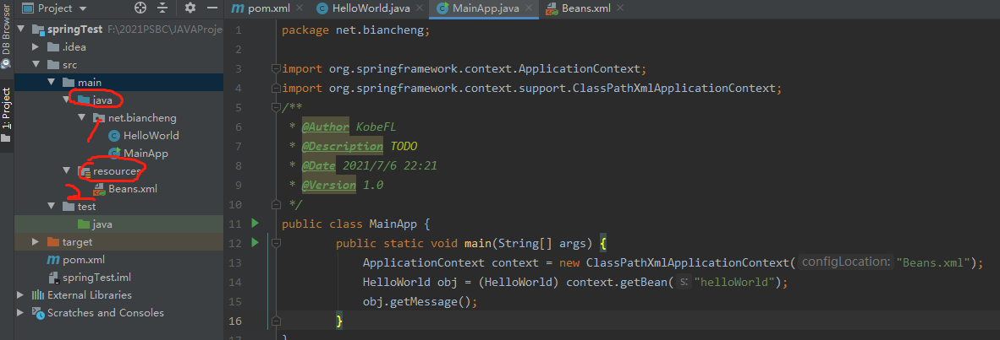

转自：[Spring](http://c.biancheng.net/spring/what-is-spring.html)  
## 一 Spring 是什么

### 1. Spring 全家桶
Spring包括许多框架，例如 Spring framework、SpringMVC、SpringBoot、Spring Cloud、Spring Data、Spring Security 等，所以有人将它们亲切的称之为：Spring 全家桶。

### 2. Spring framework
Spring framework 就是我们平时说的 Spring 框架，本套教程我们将 Spring framework 简称为 Spring 框架。Spring 框架是全家桶内其它框架的基础和核心，下面让我们来认识 Spring 框架吧。

### 3. Spring
Spring 是目前主流的 Java Web 开发框架，是 Java 世界最为成功的框架。该框架是一个轻量级的开源框架，具有很高的凝聚力和吸引力。

Spring 由 Rod Johnson 创立，2004 年发布了 Spring 框架的第一版，其目的是用于简化企业级应用程序开发的难度和周期。

### 4. IoC与AOP
Spring 是分层的 Java SE/EE 一站式轻量级开源框架，以 IoC（Inverse of Control，控制反转）和 AOP（Aspect Oriented Programming，面向切面编程）为内核。

#### 4.1 IOC
IoC 指的是将对象的创建权交给 Spring 去创建。使用 Spring 之前，对象的创建都是由我们使用 new 创建，而使用 Spring 之后，对象的创建都交给了 Spring 框架。
### 4.2 AOP
AOP 用来封装多个类的公共行为，将那些与业务无关，却为业务模块所共同调用的逻辑封装起来，减少系统的重复代码，降低模块间的耦合度。另外，AOP 还解决一些系统层面上的问题，比如日志、事务、权限等。

### 5 Bean
在 Spring 中，认为一切 Java 类都是资源，而资源都是类的实例对象（Bean），容纳并管理这些 Bean 的是 Spring 所提供的 IoC 容器，所以 Spring 是一种基于 Bean 的编程，它深刻地改变着 Java 开发世界，使用基本的 JavaBean 来完成以前只有 EJB 才能完成的工作，使得很多复杂的代码变得优雅和简洁，避免了 EJB 臃肿、低效的开发模式，极大的方便项目的后期维护、升级和扩展。迅速地取代 EJB 成为了实际的开发标准。


### 6 三层体系架构
在实际开发中，服务器端通常采用三层体系架构，分别为表现层（web）、业务逻辑层（service）、持久层（dao）。

Spring 致力于 Java EE 应用各层的解决方案，对每一层都提供了技术支持。在表现层提供了与 Spring MVC、Struts2 框架的整合，在业务逻辑层可以管理事务和记录日志等，在持久层可以整合 MyBatis、Hibernate 和 JdbcTemplate 等技术。这就充分体现出 Spring 是一个全面的解决方案，对于已经有较好解决方案的领域，Spring 绝不做重复的事情。


Spring 作为实现 Java EE 的一个全方位应用程序框架，为开发企业级应用提供了一个健壮、高效的解决方案。它不仅可以应用于服务器端开发，也可应用于任何 Java 应用的开发。

### 7 Spring 框架具有以下几个特点。
1. 方便解耦，简化开发
Spring 就是一个大工厂，可以将所有对象的创建和依赖关系的维护交给 Spring 管理。
2. 方便集成各种优秀框架
Spring 不排斥各种优秀的开源框架，其内部提供了对各种优秀框架（如 Struts2、Hibernate、MyBatis 等）的直接支持。
3. 降低 Java EE API 的使用难度
Spring 对 Java EE 开发中非常难用的一些 API（JDBC、JavaMail、远程调用等）都提供了封装，使这些 API 应用的难度大大降低。
4. 方便程序的测试
Spring 支持 JUnit4，可以通过注解方便地测试 Spring 程序。
5. AOP 编程的支持
Spring 提供面向切面编程，可以方便地实现对程序进行权限拦截和运行监控等功能。
6. 声明式事务的支持
只需要通过配置就可以完成对事务的管理，而无须手动编程。

---

## 二 Spring体系结构
Spring 框架采用分层的理念，根据功能的不同划分成了多个模块，这些模块大体可分为 Data Access/Integration（数据访问与集成）、Web、AOP、Aspects、Instrumentation（检测）、Messaging（消息处理）、Core Container（核心容器）和 Test。如下图所示（以下是 Spring Framework 4.x 版本后的系统架构图）。

  

**1. Data Access/Integration（数据访问／集成）**
数据访问／集成层包括 JDBC、ORM、OXM、JMS 和 Transactions 模块，具体介绍如下。
**1.1 JDBC 模块：** 提供了一个 JBDC 的样例模板，使用这些模板能消除传统冗长的 JDBC 编码还有必须的事务控制，而且能享受到 Spring 管理事务的好处。
**1.2ORM 模块：** 提供与流行的“对象-关系”映射框架无缝集成的 API，包括 JPA、JDO、Hibernate 和 MyBatis 等。而且还可以使用 Spring 事务管理，无需额外控制事务。
**1.3 OXM 模块：** 提供了一个支持 Object /XML 映射的抽象层实现，如 JAXB、Castor、XMLBeans、JiBX 和 XStream。将 Java 对象映射成 XML 数据，或者将XML 数据映射成 Java 对象。
**1.4 JMS 模块：** 指 Java 消息服务，提供一套 “消息生产者、消息消费者”模板用于更加简单的使用 JMS，JMS 用于用于在两个应用程序之间，或分布式系统中发送消息，进行异步通信。
**1.5 Transactions 事务模块：** 支持编程和声明式事务管理。

**2. Web模块**
Spring 的 Web 层包括 Web、Servlet、WebSocket 和 Portlet 组件，具体介绍如下。
**2.1 Web 模块：** 提供了基本的 Web 开发集成特性，例如多文件上传功能、使用的 Servlet 监听器的 IOC 容器初始化以及 Web 应用上下文。
**2.2 Servlet 模块：** 提供了一个 Spring MVC Web 框架实现。Spring MVC 框架提供了基于注解的请求资源注入、更简单的数据绑定、数据验证等及一套非常易用的 JSP 标签，完全无缝与 Spring 其他技术协作。
**2.3 WebSocket 模块：** 提供了简单的接口，用户只要实现响应的接口就可以快速的搭建 WebSocket Server，从而实现双向通讯。
**2.4 Portlet 模块：** 提供了在 Portlet 环境中使用 MVC 实现，类似 Web-Servlet 模块的功能。

**3. Core Container（Spring的核心容器）**
Spring 的核心容器是其他模块建立的基础，由 Beans 模块、Core 核心模块、Context 上下文模块和 SpEL 表达式语言模块组成，没有这些核心容器，也不可能有 AOP、Web 等上层的功能。具体介绍如下。
**3.1 Beans 模块：** 提供了框架的基础部分，包括控制反转和依赖注入。
**3.2 Core 核心模块：** 封装了 Spring 框架的底层部分，包括资源访问、类型转换及一些常用工具类。
**3.3 Context 上下文模块：** 建立在 Core 和 Beans 模块的基础之上，集成 Beans 模块功能并添加资源绑定、数据验证、国际化、Java EE 支持、容器生命周期、事件传播等。ApplicationContext 接口是上下文模块的焦点。
**3.4 SpEL 模块：** 提供了强大的表达式语言支持，支持访问和修改属性值，方法调用，支持访问及修改数组、容器和索引器，命名变量，支持算数和逻辑运算，支持从 Spring 容器获取 Bean，它也支持列表投影、选择和一般的列表聚合等。

**4. AOP、Aspects、Instrumentation和Messaging**
在 Core Container 之上是 AOP、Aspects 等模块，具体介绍如下：
**4.1 AOP 模块：** 提供了面向切面编程实现，提供比如日志记录、权限控制、性能统计等通用功能和业务逻辑分离的技术，并且能动态的把这些功能添加到需要的代码中，这样各司其职，降低业务逻辑和通用功能的耦合。
**4.2 Aspects 模块：** 提供与 AspectJ 的集成，是一个功能强大且成熟的面向切面编程（AOP）框架。
**4.3 Instrumentation 模块：** 提供了类工具的支持和类加载器的实现，可以在特定的应用服务器中使用。
**4.4 messaging 模块：** Spring 4.0 以后新增了消息（Spring-messaging）模块，该模块提供了对消息传递体系结构和协议的支持。
**5. Test模块**
Test 模块：Spring 支持 Junit 和 TestNG 测试框架，而且还额外提供了一些基于 Spring 的测试功能，比如在测试 Web 框架时，模拟 Http 请求的功能。  

---

## 三 第一个Spring程序
参考：[Idea创建maven spring程序](https://blog.csdn.net/jiahanghacker/article/details/88871207)  
 ### 1. 创建步骤
 
1. Idea中new project->maven->然后填写next就可以

2. 在java目录下创建上图的net包，然后穿件HelloWorld.java和MainApp.java.
在resources中创建Beans.xml

其中：HelloWorld
```java
public class HelloWorld {
    private String message;

    public void setMessage(String message) {
        this.message = message;
    }

    public void getMessage() {
        System.out.println("message : " + message);
    }
}

```
MainApp
```java
import org.springframework.context.ApplicationContext;
import org.springframework.context.support.ClassPathXmlApplicationContext;
public class MainApp {
        public static void main(String[] args) {
            ApplicationContext context = new ClassPathXmlApplicationContext("Beans.xml");
            HelloWorld obj = (HelloWorld) context.getBean("helloWorld");
            obj.getMessage();
        }
}
```
关于以上代码，需要注意以下两点：
创建 ApplicationContext 对象时，我们使用了 ClassPathXmlApplicationContext 类。该类用于加载 Spring 配置文件、创建和初始化所有对象，也就是下面配置文件中提到的 Bean。
ApplicationContext.getBean() 方法用来获取 Bean，该方法返回值类型为 Object，通过强制类型转换为 HelloWorld 的实例对象，根据该对象调用类中的方法。
Beans.xml
```xml
<?xml version="1.0" encoding="UTF-8"?>
<beans xmlns="http://www.springframework.org/schema/beans"
       xmlns:xsi="http://www.w3.org/2001/XMLSchema-instance"
       xsi:schemaLocation="http://www.springframework.org/schema/beans
   http://www.springframework.org/schema/beans/spring-beans-3.0.xsd">

    <bean id="helloWorld" class="net.biancheng.HelloWorld">
        <property name="message" value="Hello World!" />
    </bean>

</beans>
```
也可以将该配置文件命名为其它有效的名称。需要注意的是，该文件名必须与 MainApp.java 中读取的配置文件名称一致。

Beans.xml 用于给不同的 Bean 分配唯一的 ID，并给相应的 Bean 属性赋值。例如，在以上代码中，我们可以在不影响其它类的情况下，给 message 变量赋值。


**问题：对于出现Error:java: 错误: 不支持发行版本 5**
解决办法：[java 5错误](https://blog.csdn.net/qq_22076345/article/details/82392236)
将projectStructure和setting中的jdk11换为jdk8  
---

