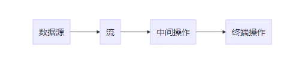

参考：[java8 stream常用方法](https://blog.csdn.net/zxl646801924/article/details/90374320)
# java8 stream常用方法

## 一. 什么是 Stream

`Stream `中文称为 “流”，通过将集合转换为这么一种叫做 “流” 的元素序列，通过声明性方式，能够对集合中的每个元素进行一系列并行或串行的流水线操作。

## 二. 流操作


整个流操作就是一条流水线，将元素放在流水线上一个个地进行处理。

其中数据源便是原始集合，然后将如 List<T> 的集合转换为 Stream<T> 类型的流，并对流进行一系列的中间操作，比如过滤保留部分元素、对元素进行排序、类型转换等；最后再进行一个终端操作，可以把 Stream 转换回集合类型，也可以直接对其中的各个元素进行处理，比如打印、比如计算总数、计算最大值等等

很重要的一点是，很多流操作本身就会返回一个流，所以多个操作可以直接连接起来，我们来看看一条 Stream 操作的代码：

如果是以前，进行这么一系列操作，你需要做个迭代器或者 foreach 循环，然后遍历，一步步地亲力亲为地去完成这些操作；但是如果使用流，你便可以直接声明式地下指令，流会帮你完成这些操作。

## 三. 常用方法
**1. filter(T -> boolean)**
保留 boolean 为 true 的元素
```java
//保留年龄为 20 的 person 元素
list = list.stream()
            .filter(person -> person.getAge() == 20)
            .collect(toList());
 
//打印输出 [Person{name='jack', age=20}]
```
`collect(toList()) `可以把流转换为 `List `类型

**2. distinct()**
去除重复元素，这个方法是通过类的 `equals` 方法来判断两个元素是否相等的

如例子中的 `Person `类，需要先定义好 `equals `方法，不然类似`[Person{name='jack', age=20}, Person{name='jack', age=20}]`这样的情况是不会处理的

**3. sorted() / sorted((T, T) -> int)**
如果流中的元素的类实现了 `Comparable` 接口，即有自己的排序规则，那么可以直接调用` sorted() `方法对元素进行排序，如 `Stream`

反之, 需要调用 `sorted((T, T) -> int) `实现 `Comparator `接口
```java
//根据年龄大小来比较：
list = list.stream()
           .sorted((p1, p2) -> p1.getAge() - p2.getAge())
           .collect(toList());
```
当然这个可以简化为，推荐使用写法简单明了
```java
list = list.stream()
           .sorted(Comparator.comparingInt(Person::getAge))
           .collect(toList());
```
**4. limit(long n)**
返回前 n 个元素
```java
list = list.stream()
            .limit(2)
            .collect(toList());
 
打印输出 [Person{name='jack', age=20}, Person{name='mike', age=25}]
```

**5. skip(long n)**
去除前 n 个元素
```java
list = list.stream()
            .skip(2)
            .collect(toList());
 
打印输出 [Person{name='tom', age=30}]
```
tips:

   - 用在 limit(n) 前面时，先去除前 m 个元素再返回剩余
元素的前 n 个元素
   - limit(n) 用在 skip(m) 前面时，先返回前 n 个元素再在剩余的 n 个元素中去除 m 个元素
  
```java
list = list.stream()
            .limit(2)
            .skip(1)
            .collect(toList());
 
打印输出 [Person{name='mike', age=25}]
```
**6. map(T -> R)**
将流中的每一个元素 T 映射为 R（类似类型转换）
```java
List<String> newlist = list.stream().map(Person::getName).collect(toList());
```
newlist 里面的元素为 list 中每一个 Person 对象的 name 变量
**7. flatMap(T -> Stream)**
将流中的每一个元素 T 映射为一个流，再把每一个流连接成为一个流
```java
List<String> list = new ArrayList<>();
list.add("aaa bbb ccc");
list.add("ddd eee fff");
list.add("ggg hhh iii");
 
list = list.stream().map(s -> s.split(" ")).flatMap(Arrays::stream).collect(toList());
```
上面例子中，我们的目的是把 List 中每个字符串元素以" "分割开，变成一个新的 List。
首先 map 方法分割每个字符串元素，但此时流的类型为 Stream<String[ ]>，因为 split 方法返回的是 String[ ] 类型；所以我们需要使用 flatMap 方法，先使用Arrays::stream将每个 String[ ] 元素变成一个 Stream 流，然后 flatMap 会将每一个流连接成为一个流，最终返回我们需要的 Stream

**8.anyMatch(T -> boolean)**
流中是否有一个元素匹配给定的 T -> boolean 条件
```java
是否存在一个 person 对象的 age 等于 20：
boolean b = list.stream().anyMatch(person -> person.getAge() == 20);
```
**9. allMatch(T -> boolean)**
流中是否所有元素都匹配给定的 T -> boolean 条件

**10. noneMatch(T -> boolean)**
流中是否没有元素匹配给定的 T -> boolean 条件

**11. findAny() 和 findFirst()**
findAny()：找到其中一个元素 （使用 stream() 时找到的是第一个元素；使用 parallelStream() 并行时找到的是其中一个元素）
findFirst()：找到第一个元素
值得注意的是，这两个方法返回的是一个 Optional 对象，它是一个容器类，能代表一个值存在或不存在，这个后面会讲到

**12. reduce((T, T) -> T) 和 reduce(T, (T, T) -> T)**
用于组合流中的元素，如求和，求积，求最大值等，还有价格计算时我们的类型是BigDecimal类型
```java
计算年龄总和：
int sum = list.stream().map(Person::getAge).reduce(0, (a, b) -> a + b);
与之相同:
int sum = list.stream().map(Person::getAge).reduce(0, Integer::sum);
 
BigDecimal计算，将所有商品的价格累加
BigDecimal totalPrice = goodList.stream().map(GoodsCode::getPrice()).reduce(BigDecimal.ZERO, BigDecimal::add);
```
其中，reduce 第一个参数 0 代表起始值为 0，lambda (a, b) -> a + b 即将两值相加产生一个新值

同样地：
```java
计算年龄总乘积：
int sum = list.stream().map(Person::getAge).reduce(1, (a, b) -> a * b);
```
当然也可以:
```java
Optional<Integer> sum = list.stream().map(Person::getAge).reduce(Integer::sum);
```
即不接受任何起始值，但因为没有初始值，需要考虑结果可能不存在的情况，因此返回的是 Optional 类型

**13. count()**
返回流中元素个数，结果为 long 类型

**14. collect()**
收集方法，我们很常用的是 collect(toList())，当然还有 collect(toSet()) 等，参数是一个收集器接口，这个后面会另外讲

**15. forEach()**
返回结果为 void，很明显我们可以通过它来干什么了，比方说：
```java
unordered()
还有这个比较不起眼的方法，返回一个等效的无序流，当然如果流本身就是无序的话，那可能就会直接返回其本身
打印各个元素：
list.stream().forEach(System.out::println);
```
再比如说 MyBatis 里面访问数据库的 mapper 方法：
```java
向数据库插入新元素：
list.stream().forEach(PersonMapper::insertPerson);
```
## 四. 数值流
前面介绍的如
int sum = list.stream().map(Person::getAge).reduce(0, Integer::sum); 计算元素总和的方法其中暗含了装箱成本，map(Person::getAge) 方法过后流变成了 Stream 类型，而每个 Integer 都要拆箱成一个原始类型再进行 sum 方法求和，这样大大影响了效率。

针对这个问题 Java 8 有良心地引入了数值流 IntStream, DoubleStream, LongStream，这种流中的元素都是原始数据类型，分别是 int，double，long


流转换为数值流

   - mapToInt(T -> int) : return IntStream
   - mapToDouble(T -> double) : return DoubleStream
   - mapToLong(T -> long) : return LongStream

```java
IntStream intStream = list.stream().mapToInt(Person::getAge);
```
当然如果是下面这样便会出错
```java
LongStream longStream = list.stream().mapToInt(Person::getAge);
```
因为 getAge 方法返回的是 int 类型（返回的如果是 Integer，一样可以转换为 IntStream）

数值流转换为流

很简单，就一个 boxed
```java
Stream<Integer> stream = intStream.boxed();
```
**2. 数值流方法**
下面这些方法作用不用多说，看名字就知道：

- `sum()`
- `max()`
- `min()`
- `average()` 等...
**3. 数值范围**
IntStream 与 LongStream 拥有 range 和 rangeClosed 方法用于数值范围处理

IntStream ： rangeClosed(int, int) / range(int, int) LongStream ： rangeClosed(long, long) / range(long, long)

我们可以利用 IntStream.rangeClosed(1, 100) 生成 1 到 100 的数值流

```java
求 1 到 10 的数值总和：
IntStream intStream = IntStream.rangeClosed(1, 10);
int sum = intStream.sum();
```
这两个方法的区别在于一个是闭区间，一个是半开半闭区间：

- `rangeClosed(1, 100) ：[1, 100]`
- `range(1, 100) ：[1, 100)`

**4.汇总**
**（1）counting**
用于计算总和：
```java
long l = list.stream().collect(counting());
```
没错，你应该想到了，下面这样也可以：
```java
long l = list.stream().count();
```
推荐第二种
**（2）summingInt ，summingLong ，summingDouble**
summing，没错，也是计算总和，不过这里需要一个函数参数

计算 Person 年龄总和：
```java
int sum = list.stream().collect(summingInt(Person::getAge));
```
当然，这个可以也简化为：
```java
int sum = list.stream().mapToInt(Person::getAge).sum();
```
除了上面两种，其实还可以：
```java
int sum = list.stream().map(Person::getAge).reduce(Interger::sum).get();
```

推荐第二种

由此可见，函数式编程通常提供了多种方式来完成同一种操作

**（3）averagingInt，averagingLong，averagingDouble**
看名字就知道，求平均数
```java
Double average = list.stream().collect(averagingInt(Person::getAge));
```
当然也可以这样写
```java
OptionalDouble average = list.stream().mapToInt(Person::getAge).average();
```
不过要注意的是，这两种返回的值是不同类型的

**（4）summarizingInt，summarizingLong，summarizingDouble**
这三个方法比较特殊，比如 summarizingInt 会返回 IntSummaryStatistics 类型
```java
IntSummaryStatistics l = list.stream().collect(summarizingInt(Person::getAge));
```
IntSummaryStatistics 包含了计算出来的平均值，总数，总和，最值，可以通过下面这些方法获得相应的数据

**3. 取最值**
maxBy，minBy 两个方法，需要一个 Comparator 接口作为参数

```java
Optional<Person> optional = list.stream().collect(maxBy(comparing(Person::getAge)));
```
我们也可以直接使用 max 方法获得同样的结果
```java
Optional<Person> optional = list.stream().max(comparing(Person::getAge));
```
**4. joining 连接字符串**
也是一个比较常用的方法，对流里面的字符串元素进行连接，其底层实现用的是专门用于字符串连接的 StringBuilder
```java
String s = list.stream().map(Person::getName).collect(joining());
 
结果：jackmiketom
```
```jva
String s = list.stream().map(Person::getName).collect(joining(","));
 
结果：jack,mike,tom
```
joining 还有一个比较特别的重载方法：
```java
String s = list.stream().map(Person::getName).collect(joining(" and ", "Today ", " play games."));
 
结果：Today jack and mike and tom play games.
```
即 Today 放开头，play games. 放结尾，and 在中间连接各个字符串

**5. groupingBy 分组**
groupingBy 用于将数据分组，最终返回一个 Map 类型
```java
Map<Integer, List<Person>> map = list.stream().collect(groupingBy(Person::getAge));
```
例子中我们按照年龄 age 分组，每一个 Person 对象中年龄相同的归为一组

另外可以看出，Person::getAge 决定 Map 的键（Integer 类型），list 类型决定 Map 的值（List 类型）

**多级分组**
groupingBy 可以接受一个第二参数实现多级分组：
```java
Map<Integer, Map<T, List<Person>>> map = list.stream().collect(groupingBy(Person::getAge, groupBy(...)));
```
其中返回的 Map 键为 Integer 类型，值为 Map<T, List> 类型，即参数中 groupBy(...) 返回的类型

**按组收集数据**
```java
Map<Integer, Integer> map = list.stream().collect(groupingBy(Person::getAge, summingInt(Person::getAge)));
该例子中，我们通过年龄进行分组，然后 summingInt(Person::getAge)) 分别计算每一组的年龄总和（Integer），最终返回一个 Map<Integer, Integer>

根据这个方法，我们可以知道，前面我们写的：
```java
groupingBy(Person::getAge)
```
其实等同于：
```java
groupingBy(Person::getAge, toList())
```
**6. partitioningBy 分区**
分区与分组的区别在于，分区是按照 true 和 false 来分的，因此partitioningBy 接受的参数的 lambda 也是 T -> boolean
```java
根据年龄是否小于等于20来分区
Map<Boolean, List<Person>> map = list.stream()
                                     .collect(partitioningBy(p -> p.getAge() <= 20));
打印输出
{
    false=[Person{name='mike', age=25}, Person{name='tom', age=30}], 
    true=[Person{name='jack', age=20}]
}
```
同样地 partitioningBy 也可以添加一个收集器作为第二参数，进行类似 groupBy 的多重分区等等操作。

 

**7. 并行**
之前我就讲到了 parallelStream 方法能生成并行流，因此你通常可以使用 parallelStream 来代替 stream 方法，但是并行的性能问题非常值得我们思考
```java
 int i = Stream.iterate(1, a -> a + 1).limit(100).parallel().reduce(0, Integer::sum);
```
我们通过这样一行代码来计算 1 到 100 的所有数的和，我们使用了 parallel 来实现并行。

但实际上是，这样的计算，效率是非常低的，比不使用并行还低！一方面是因为装箱问题，这个前面也提到过，就不再赘述，还有一方面就是 iterate 方法很难把这些数分成多个独立块来并行执行，因此无形之中降低了效率。

流的可分解性
这就说到流的可分解性问题了，使用并行的时候，我们要注意流背后的数据结构是否易于分解。比如众所周知的 ArrayList 和 LinkedList，明显前者在分解方面占优。

我们来看看一些数据源的可分解性情况
|数据源|      可分解性|
|:----: |      :----:|
|ArrayList|	     极佳|
|LinkedList|       差|
|IntStream.range|极佳|
|Stream.iterate|   差|
|HashSet	|      好|
|TreeSet	|      好|

**顺序性**

除了可分解性，和刚刚提到的装箱问题，还有一点值得注意的是一些操作本身在并行流上的性能就比顺序流要差，比如：limit，findFirst， 因为这两个方法会考虑元素的顺序性，而并行本身就是违背顺序性的，也是因为如此 findAny 一般比 findFirst 的效率要高。
