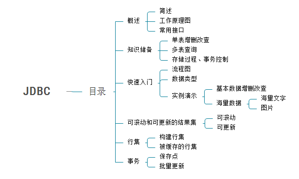
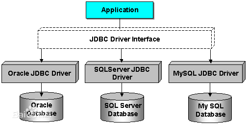
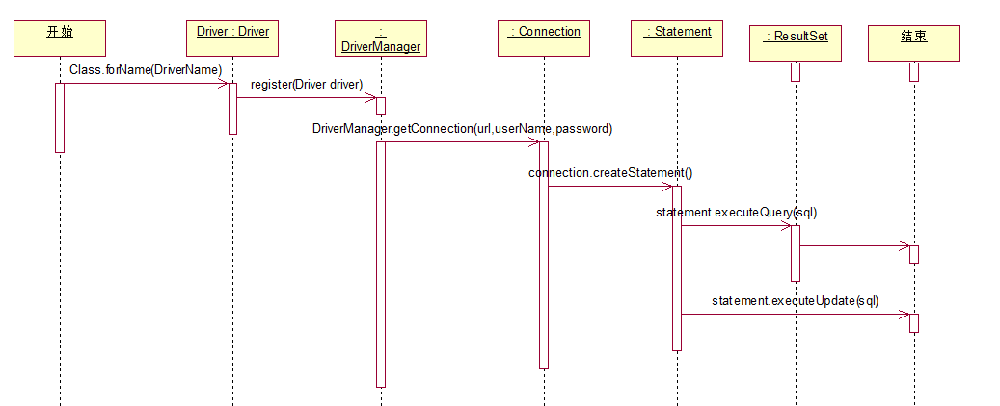
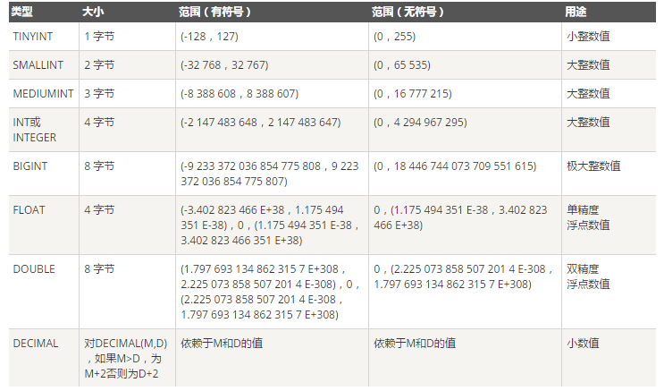
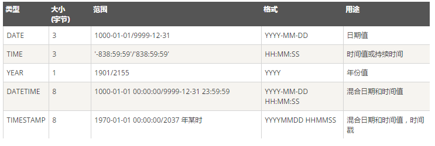
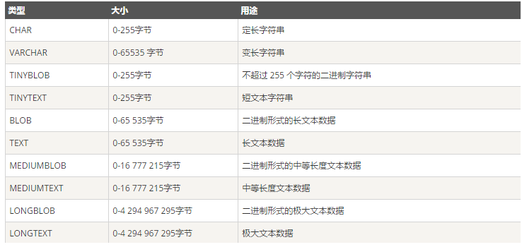

参考+转载：
[浅谈对JDBC的理解](https://blog.csdn.net/zdb292034/article/details/81705876)
[菜鸟教程JDBC](https://www.runoob.com/w3cnote/jdbc-use-guide.html)  


## 一. 目录


## 二. JDBC简述

**1. JDBC是什么？** 
JDBC英文名为：Java Data Base Connectivity(Java数据库连接)，官方解释它是Java编程语言和广泛的数据库之间独立于数据库的连接标准的Java API，根本上说JDBC是一种规范，它提供的接口，一套完整的，允许便捷式访问底层数据库。

可以用JAVA来写不同类型的可执行文件：JAVA应用程序、JAVA Applets、
Java Servlet、JSP等，不同的可执行文件都能通过JDBC访问数据库，又兼备存储的优势。**简单说它就是JAVA与数据库的连接的桥梁或者插件**，用JAVA代码就能操作数据库的增删改查、存储过程、事务等。

**2.JDBC有什么用？** 
我们用JAVA就能连接到数据库；创建SQL或者MYSQL语句；执行SQL或MYSQL的查询数据库；查看和修改结果记录。

　　我们思考一下？数据库是由不同生产产商决定的，例如Mysql、Oracle、SQL Server,而如果JAVA JDK不可能说提供对不同数据库的实现吧？还有，JAVA具备天生跨平台的优势，它就提供了JDBC的接口API，具体的实现由不同的生产产商决定。这样，数据库生产产商都根据JAVA API去实现各自的应用驱动，这问题就迎刃而解了。

　　JDBC的工作原理是什么？我将在下一篇文章叙述JDBC运用的设计模式，以及部分JDK源码。

**3. JDBC工作原理图**


即，java程序通过JDBC接口，访问不同的数据库，对其进行增删改查等操作。


**4. 常用接口**
　　 提供的接口包括：JAVA API：提供对JDBC的管理链接；JAVA Driver API：支持JDBC管理到驱动器连接。

　　 DriverManager：这个类管理数据库驱动程序的列表，查看加载的驱动是否符合JAVA Driver API的规范。

　　 Connection：与数据库中的所有的通信是通过唯一的连接对象。

　　 Statement：把创建的SQL对象，转而存储到数据库当中。

　　 ResultSet：它是一个迭代器，用于检索查询数据。


## 三. 快速入门
**1. 操作流程图**


**2.数据类型图**
2.1 数字类型


2.2 时间日期类型


2.3 字符串类型


## 4. 实例练习

**1.Connection**
```java
public class JDBCUtil {
    //Driver类全名
    public static String DRIVER="com.mysql.jdbc.Driver";
    //jdbc协议:子协议://ip:端口号/数据库名
    public static String URL="jdbc:mysql://localhost:3306/test";
    //数据库用户名
    public static String USERNAME="root";
    //数据库密码
    public static String PASSWORD="root";

    private static Connection connection=null;

    /**
     * 获取JDBC连接
     * @return
     */
    public  static Connection getConnection(){
        try {
            //加载驱动程序：它通过反射创建一个driver对象。
            Class.forName(DRIVER);

            //获得数据连接对象。
            // 在返回connection对象之前，DriverManager它内部会先校验驱动对象driver信息对不对,我们只要知道内部过程即可。
            connection= DriverManager.getConnection(URL,USERNAME,PASSWORD);
            return connection;
        } catch (Exception e) {
            e.printStackTrace();
        }
        return null;
    }

    /**
     * 通过读取文件连接
     * @param fileName
     * @return
     * @throws SQLException
     */
    public   Connection getConnectionByLoadSettingFile(String fileName) throws SQLException {
        /*
            文件里面的内容：跟上面的常量一模一样
            jdbc.driver=com.mysql.jdbc.Driver
            jdbc.url=jdbc:mysql://localhost:3306/test?useUnicode=true&characterEncoding=utf-8
            jdbc.username=root
            jdbc.password=root
        */
        Properties props=new Properties();
        try {
            //我的properties文件是放在src根目录下的
            InputStream in=DBUtil.class.getResourceAsStream("/"+fileName);
            if(null==in)
                System.out.println("找不到文件:"+fileName);
            props.load(in);
        } catch (Exception e) {
            e.printStackTrace();
        }
        String driver=props.getProperty("jdbc.driver");
        if(null!=driver)
            System.setProperty("jdbc.drivers",driver);
        String url=props.getProperty("jdbc.url");
        String username=props.getProperty("jdbc.username");
        String password=props.getProperty("jdbc.password");
        connection=DriverManager.getConnection(url,username,password);
        return connection;
    }
}

```
**2. statement**
```java
public class MyClient {
    public static void main(String [] args) throws SQLException {
        Connection connection=null;
        Statement statement=null;

        connection=JDBCUtil.getConnection();
        statement=connection.createStatement();
        //需要在自己的数据库当中建立一张user表
        String sql="insert into user(loginName,userName,password,sex)values('tom123','tom','123456',1)";
        statement.executeUpdate(sql);
    }
}
```

**3. PareparedStatement**
```java
public class MyClient {
    public static void main(String [] args) throws SQLException {
        Connection connection=null;
        PreparedStatement pStatement=null;

        connection=JDBCUtil.getConnection();
        String sql="insert into user(loginName,userName,password,sex)values(?,?,?,?)";
        //预编译
        pStatement=connection.prepareStatement(sql);
        //前面的索引对应上面的问号,传递参数。
        pStatement.setString(1,"tom123");
        pStatement.setString(2,"tom");
        pStatement.setString(3,"123456");
        pStatement.setInt(4,1);
        pStatement.executeUpdate();
    }
}
```

**4. ResultSet**
```java
public class MyClient {
    public static void main(String [] args) throws SQLException {
        Connection connection=null;
        Statement statement=null;
        ResultSet resultSet;

        connection=JDBCUtil.getConnection();
        String sql="select * from user";
        statement=connection.createStatement();
        //resultSet就是一个迭代器,里面的方法跟迭代器几乎一致。
        resultSet=statement.executeQuery(sql);
        while (resultSet.next()){
            String loginName=resultSet.getString("loginName");
            String userName=resultSet.getString("userName");
            String password=resultSet.getString("password");
            int sex=resultSet.getInt("sex");
            System.out.println(loginName+"-"+userName+"-"+password+"-"+sex);
        }
    }
}
```

## 四. 可滚动和可更新的结果集
**1. 相关参数**
```java
//了解数据集可滚动更新：查看ResultSet接口的几个参数

　　/** 结果集不能滚动(默认值)*/
    int TYPE_FORWARD_ONLY = 1003;

    /**　结果集可以滚动，但对数据库变化不敏感*/
    int TYPE_SCROLL_INSENSITIVE = 1004;

    /**结果集可以滚动，且对数据库变化敏感*/
    int TYPE_SCROLL_SENSITIVE = 1005;
　　
　　/**结果集不能用于更新数据库(默认值)*/
    int CONCUR_READ_ONLY = 1007;

    /**结果集可以用于更新数据库*/
    int CONCUR_UPDATABLE = 1008;
```

**2. 可滚动可更新**
注意:**可滚动**简单说就是设置结果集可更新resultSet目前的游标值。可更新就是可以更新结果集里面的增删改查。可更新简单说，就是获取数据集ResultSet以后改动更加灵活。
```java
public class Client {
    public static void main(String [] args){
        Connection connection=null;
        PreparedStatement pStatement=null;
        Statement statement=null;
        ResultSet resultSet=null;
        try {
            connection=DBUtil.getInstance().getConnection();
            //第一个参数设置是否可以滚动，第二个参数设置是否可更新
            statement=connection.createStatement(ResultSet.TYPE_SCROLL_INSENSITIVE,ResultSet.CONCUR_UPDATABLE);
            String sql="select * from user";
            ResultSet rs=statement.executeQuery(sql);

            /**可滚动的几个方法
                rs.previous();
                rs.next();
                rs.getRow();
                rs.absolute(0);
             **/

            //往数据集里面插入数据同时更新到数据：从表的最后开始插入。
            rs.moveToInsertRow();//把游标移动到插入行，默认在最后一行。
            rs.updateString("loginName","小白脸");
            rs.updateString("userName","大猩猩");
            rs.updateString("password","123");
            rs.updateInt("sex",100);
            rs.insertRow();
            rs.moveToCurrentRow();//把游标移动最后一个位置

            //删除第十行数据
            rs.absolute(10);
            rs.deleteRow();

            while(rs.next()){
                System.out.println(rs.getString(2));
                //把数据集里的数据中的性别全部更新为0
                rs.updateInt("sex",0);
                rs.updateRow();
            }
        } catch (SQLException e) {
            e.printStackTrace();
        }
    }
}
```

## 五.事务
**1.事务是什么？**
我们将一组语句构成一个事务。当所有语句都是顺利执行以后，事务可以被提交。否则，如果其中某个语句遇到错误，那么事务将被**回滚**，就好像任何语句都没有被执行一样。

　　实际用例。假设我们需要将钱从一个银行账号转移到另外一个账号。此时，一个非常重要的问题就是我们必须同时将钱从一个账号取出并且存入另一个账号。如果在将钱存入其他账号之前系统发生崩溃，那么我们必须撤销取款操作。

**2.事务有什么特性或者说有什么作用？**
> `原子性`：最小的单元，如果一个是失败了，则一切的操作将全部失败。
`一致性`：如果事务出现错误，则回到最原始的状态
`隔离性`：多个事务之间无法访问，只有当事务完成后才可以看到结果
`持久性`：当一个系统崩溃时，一个事务依然可以提交，当事务完成后，操作结果保存在磁盘中，不会被回滚

**3. 保存点与批量更新**
**3.1 保存点与事务的接口源码**

```java
public interface Connection  extends Wrapper, AutoCloseable {
    /** 设置提交方式：自动还是手动*/
    void setAutoCommit(boolean autoCommit) throws SQLException;
    
    boolean getAutoCommit() throws SQLException;

    /**提交事务*/
    void commit() throws SQLException;

   /**事务回滚*/
    void rollback() throws SQLException;
    
    /**设置保存点*/
    Savepoint setSavepoint() throws SQLException;

    Savepoint setSavepoint(String name) throws SQLException;
    
    /**回滚到保存点*/
    void rollback(Savepoint savepoint) throws SQLException;
    
    /**释放保存点资源*/
    void releaseSavepoint(Savepoint savepoint) throws SQLException;
}

public interface Statement  extends Wrapper, AutoCloseable {
    /**加入到批量处理队列*/
    void addBatch( String sql ) throws SQLException;
    
    void clearBatch() throws SQLException;

    /**执行批量处理队列*/
    int[] executeBatch() throws SQLException;
}
```

**3.2什么是保存点？**
使用保存点可以更细粒度地控制回滚操作，而不用每次都退回到初始点。

**3.3什么又是批量更新？**
批量更新包括批量增删改，当我们一次性要插入很多条数据的时候，假设我们每次提交一次又获取数据库连接一次，然后又关闭数据库连接，而且数据库连接是一个耗时操作，这样会大大降低性能，后续文章我会对这部分内容进行详细叙述。而批量更新呢，则先把数据放入一个队列里，并没有真正存入数据库中，当调用`commit()`方法的时候，队列的数据的操作一次性收集和提交。

```java
public class Client {
    public static void main(String [] args) throws SQLException {
        long time=System.currentTimeMillis();
        Connection connection=null;
        PreparedStatement pStatement=null;
        boolean autoCommit=false;
        Savepoint savepoint=null;
        try {
            connection=JDBCUtil.getConnection();
            autoCommit=connection.getAutoCommit();
            connection.setAutoCommit(false);
            String sql="insert into user(loginName,userName,password,sex)values(?,?,?,?)";
            pStatement=connection.prepareStatement(sql);
            //设置保存点
            savepoint=connection.setSavepoint("savePoint");
            for(int i=0;i<1000;i++){
                pStatement.setString(1,"tony"+i);
                pStatement.setString(2,"user"+i);
                pStatement.setString(3,i+"");
                pStatement.setInt(4,i);
                //添加到队列
                pStatement.addBatch();
            }
            //批量执行
            pStatement.executeBatch();
            connection.commit();

        } catch (SQLException e) {
            e.printStackTrace();
            //回滚到保存点
            connection.rollback(savepoint);
        }finally {
            //把事务提交设置为最初设置
            connection.setAutoCommit(autoCommit);
        }
        long temp=System.currentTimeMillis()-time;
        System.out.println(temp+"ms");
    }
}
```

## 六.思考与总结
**6.1 思考**

**问题一**：我们都知道获取JDBC连接是一个耗时操作。而我们查看教程的时候，提倡我们获取数据库连接，操作完毕以后要记得关闭，这样固然是正确的。但是，如果一个简单的操作就不停开启连接断开连接，这样会对性能大打折扣。
**问题二**：JDBC的工作原理？还有它底部运用什么设计模式，让它能够自适应不同数据库产商的驱动呢？
**问题三**：事务提交和普通提交的性能到底有多大的差别？

**6.2 总结**

　**解决一**：有一个概念叫做连接池，就是数据库连接这个耗时操作交给一个容器去管理。至于数据库什么时候连接什么时候被关闭，有几个数据库连接对象？这些完全托管给连接池，而不需要客户端去考虑，目前一个比较成熟的是c3p0的连接池。现在模拟一个单例的数据库连接，比较单例数据库连接与随开随关的性能比较。

工具类
```java
public class DBUtil {
    public static String DRIVER="com.mysql.jdbc.Driver";
    public static String URL="jdbc:mysql://localhost:3306/test";
    public static String USERNAME="root";
    public static String PASSWORD="root";

    private  Connection connection=null;
    private DBUtil(){
    }
    /**
     * 获得DB工具类的对象,这种获取对象的方式慢慢被jdk推荐使用。
     */
    public static  DBUtil getInstance(){
        return DBUtilClassInstance.dbUtil;
    }

    /**
     * 采用内部类单例模式：天然线程安全，延迟加载，调用效率高。若不了解，参考我的文章设计模式-单例模式
     */
    private static class DBUtilClassInstance{
        private  static  DBUtil dbUtil= new DBUtil();
    }

    /**
     * 获取JDBC连接
     * @return
     */
    public  Connection getConnection(){
        try {
            if(null!=connection && !connection.isClosed()){
                return connection;
            }
            Class.forName(DRIVER);
            System.out.println("驱动程序加载成功！");
            connection=DriverManager.getConnection(URL,USERNAME,PASSWORD);
            return connection;
        } catch (Exception e) {
            System.out.println("未找到驱动程序！");
            e.printStackTrace();
        }
        return null;
    }

    /**
     * 通过读取文件连接
     * @param fileName
     * @return
     * @throws SQLException
     */
    public   Connection getConnectionByLoadSettingFile(String fileName) throws SQLException {
        if(null!=connection && !connection.isClosed()){
            return connection;
        }
        Properties props=new Properties();
        try {
            InputStream in=DBUtil.class.getResourceAsStream("/"+fileName);
            if(null==in)
                System.out.println("找不到文件:"+fileName);
            props.load(in);
        } catch (Exception e) {
            e.printStackTrace();
        }
        String driver=props.getProperty("jdbc.driver");
        if(null!=driver)
            System.setProperty("jdbc.drivers",driver);
        String url=props.getProperty("jdbc.url");
        String username=props.getProperty("jdbc.username");
        String password=props.getProperty("jdbc.password");
        connection=DriverManager.getConnection(url,username,password);
        return connection;
    }
```

性能比较


```java
public class Client {
    public static void main(String [] args){
        long time=System.currentTimeMillis();
      for(int i=0;i<100;i++){
          User user=new User("loginName"+i,"userName"+i,"password"+i,i);
          myThread thread=new myThread(user);
          thread.run();
      }
      System.out.println(System.currentTimeMillis()-time+"ms");
    }
}

class myThread implements Runnable{

    private User user;

    public myThread(User user){
        this.user=user;
    }

    public void run() {
        PreparedStatement pStatement=null;
        Connection connection=null;
        try {
            connection=DBUtil.getInstance().getConnectionByLoadSettingFile("db.properties");
            String sql="insert into user(loginName,userName,password,sex)value(?,?,?,?)";
            pStatement=connection.prepareStatement(sql);
            pStatement.setString(1,user.getLoginName());
            pStatement.setString(2,user.getUserName());
            pStatement.setString(3,user.getPassword());
            pStatement.setInt(4,user.getSex());
            pStatement.executeUpdate();
        } catch (Exception e) {
            e.printStackTrace();
        }finally {
            //注释掉这个方法就是代表数据库连接用完就随即关闭。
            DBUtil.getInstance().closePreparedStatement(pStatement);
            DBUtil.getInstance().closeConnection(connection);
        }
    }
}
```