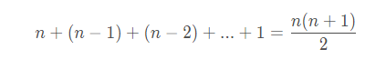
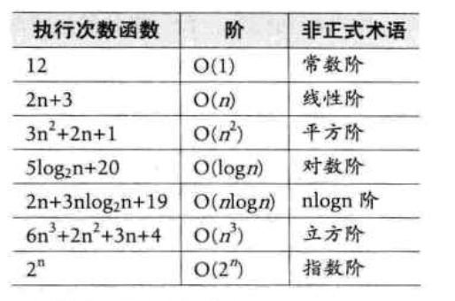
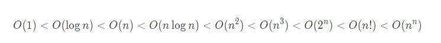

## 1. 时间复杂度
**1.时间复杂度定义：**
在进行算法分析时，语句总的执行次数T(n)是关于问题规模n的函数，进而分析T(n)随n的变化情况并确定T(n)的数量级。算法的时间复杂度，也就是算法的时间量度，记作：T(n) = O(f(n))。它表示随问题规模n的增大，算法执行时间的增长率和f(n)的增长率相同，称作算法的渐近时间复杂度，简称为时间复杂度，其中f(n)是问题规模n的某个函数。
其中，O[1]叫常数阶，O[n]叫线性阶，O[n^2]叫做平方阶。

**2. 函数的渐近增长**
步骤计算中，`常数`对数值的影响 < `乘积`对数值的影响 < `最高次项指数`的影响，而且最高次项的常数不重要。所以，判断一个算法的效率时，函数中的常数和其他次要项常常可以忽略，而更应该关注最高阶项的阶数。


**3. 推导大O阶方法：**
>1. 用常数1取代运行时间中的所有加法常数
>2. 在修改后的运行次数函数中，只保留最高阶项
>3. 如果最高阶项存在且不是1，则去除与这个项相乘的常数项

**4.1常数阶：**
所有的常数都表示为O[1], 不存在O[2], O[3]，下面的例子f(n)=3，根据上面的方法1，改为1，得O[1]
```java
int sum = 0, n = 100; // 1次
sum = (1 + n) * n / 2; // 1次
printf("%d", sum);    // 1次
```

注意，对于分支结构，无论真假，执行次数都是恒定的，除了循环结构，时间复杂度都是O[1]

**4.2 线性阶：**
分析算法的复杂度，关键就是要分析循环结构的运行情况，下面这个例子复杂度为O[n]，因为循环体中的代码要执行n次
```java
int i;
for (i = 0; i < n; i++)
{
    ... // 这里是时间复杂度为O[1]的语句
}
```
**4.3 对数阶：**
```java
int count = 1;
while (count < n)
{
    count = count * 2;
}
```
跟线性不同，这里是每次执行后，离结束都会更近，当2^x =n,即x = logn的时候，结束，所以时间复杂度为O[logn]

**4. 平方阶：**
```java
int i,j;
for (i = 0; i < n; i++)
{
    for (j = i; j < n; j++)
    {
        ... // 复杂度为O[1]的语句
    }
}
```
执行起来总次数是：

根据上面的方法，只保留最高阶，并且去除大于1阶的常数系数，所以复杂度就是O[n^2]。

**5. 常见的时间复杂度**


其耗时比较


## 2 .最坏情况和平均情况
**1. 最坏情况：** 是一种保证，就是运行时间将不会再坏了。
在应用中，这是一种最重要的需求，通常，除非特别指定，我们提到的运行时间都是最坏情况的运行时间。

**2. 平均情况：** 平均运行时间是所有情况中最有意义的，因为他是期望的运行时间。很难通过分析得到，一般都是通过运行一定数量的实验数据后估算出来的。

**3.平均时间复杂度：** 计算所有情况的平均值。

**4. 最坏时间复杂度：** 计算最坏情况下的时间复杂度，一般在没有特殊说明的情况下，都是指最坏时间复杂度。

## 3. 算法空间复杂度：
**算法的空间复杂度**通过将计算算法所需的存储空间实现，算法空间复杂度的计算公式记作：S[n] = O[f(n)]，其中，n为问题的规模，f(n)为语句关于n所占存储空间的函数。