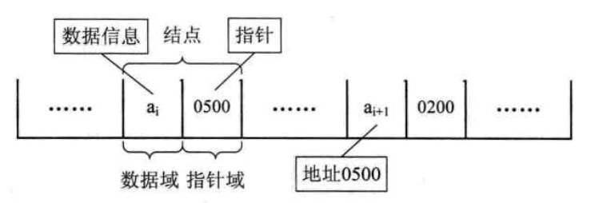
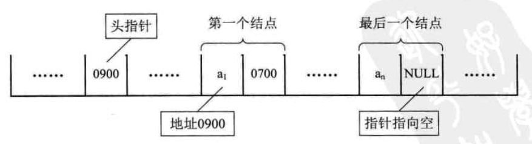
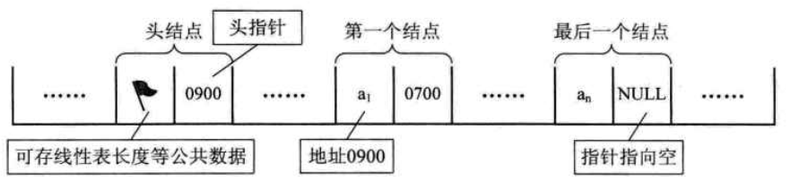
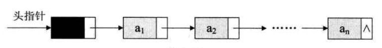

# 线性表

## 一. 基础
### 1. 线性表定义
零个或多个类型相同的数据元素的有限序列，每个元素都前后连接，有自己固定的位置。 就是List

### 2. 线性表的顺序存储结构
**1. 顺序存储结构代码**
```C++
#define MAXSIZE 20 // 存储空间初始分配量
typedef int ElemType; // 定义了一个和数据类型相同的类型
typedef struct
{
    ElemType data[MAXSIZE]; // 建立存储元素的数组
    int length;    // 线性表长度
}SqList;

```
顺序存储结构的三个属性：

* 存储空间的起始位置，由data决定
* 线性表最大容量
* 线性表当前长度

**数据长度和线性表长度的区别：** 线性表长度是元素个数，而数据长度跟数据类型有关，类型所占字节*元素个数。

顺序存储优点：查找方便、插入和删除较耗费资源

### 3. 线性表的链式存储结构
**1. 概念：** 链表存储两个信息，存储数据元素信息的域被称为数据域，存储直接后继位置的域被称为指针域，把两部分组合起来，叫做结点(Node)。

**2. 单链表：** 链表中每个结点只包含一个指针域的情况。


**3. 头指针：** 链表中第一个结点的存储位置叫做头指针，规定线性链表的最后一个结点指针为空，即Null。


**4. 头结点：** 单链表的第一个结点前敷设一个极爱但，称为头结点，头结点的数据域可以不存储任何信息，也可以存储长度等附加信息，头结点的指针域存储指向第一个结点的指针。


带有头结点的单链表：


