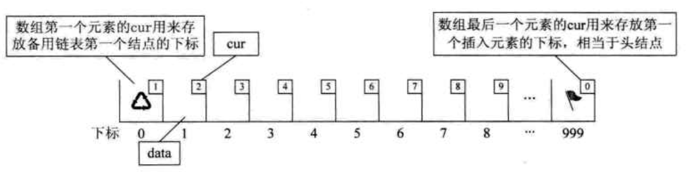
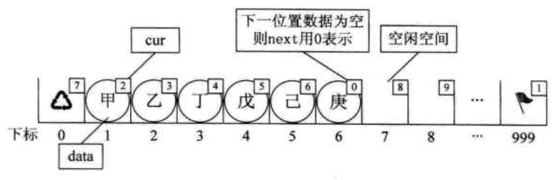
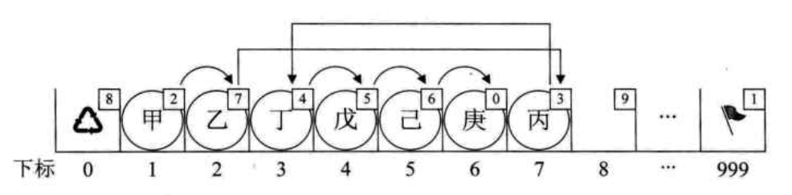
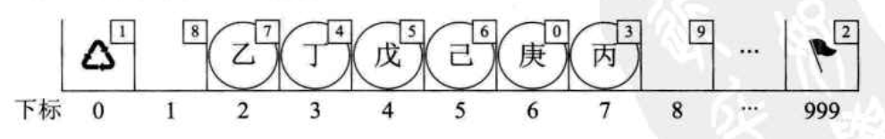

# 线性表

## 一. 基础
### 1. 线性表定义
零个或多个类型相同的数据元素的有限序列，每个元素都前后连接，有自己固定的位置。 就是List

### 2. 线性表的顺序存储结构
**1. 顺序存储结构代码**
```C++
#define MAXSIZE 20 // 存储空间初始分配量
typedef int ElemType; // 定义了一个和数据类型相同的类型
typedef struct
{
    ElemType data[MAXSIZE]; // 建立存储元素的数组
    int length;    // 线性表长度
}SqList;

```
顺序存储结构的三个属性：

* 存储空间的起始位置，由data决定
* 线性表最大容量
* 线性表当前长度

**数据长度和线性表长度的区别：** 线性表长度是元素个数，而数据长度跟数据类型有关，类型所占字节*元素个数。

顺序存储优点：查找方便、插入和删除较耗费资源

### 3. 线性表的链式存储结构
**1. 概念：** 链表存储两个信息，存储数据元素信息的域被称为数据域，存储直接后继位置的域被称为指针域，把两部分组合起来，叫做结点(Node)。

**2. 单链表：** 链表中每个结点只包含一个指针域的情况。


**3. 头指针：** 链表中第一个结点的存储位置叫做头指针，规定线性链表的最后一个结点指针为空，即Null。


**4. 头结点：** 单链表的第一个结点前的节点，称为头结点，头结点的数据域可以不存储任何信息，也可以存储长度等附加信息，头结点的指针域存储指向第一个结点的指针。


带有头结点的单链表：


#### 3.1 单链表
**1.单链表的定义、插入、查询、删除**
1.1 单链表插入原理：
在第i位置插入(插入的结点位置变为i)的算法思路：

用类似上面查找的方法，将指针移动到指向第i 个结点
让插入元素的后继指针 = 第i 个结点的后继指针
让第i个结点的后继指针 = 插入元素的地址

**2.java实现单链表**
```java
public class Node {
    //创建链表元素
    public Object data;
    public Node next;   // Node的引用

    //两个构造方法
    public Node(Object e) {
        this.data = e;
        this.next = null;
    }

    public Node() {
        this.data = null;
        this.next = null;
    }

    //删除结点
    public void del(){
        this.data = null;
        this.next = null;
    }
}

class LinkList{
    private Node head;
    private int size;

    public LinkList() {
        head = new Node();
    }

    // 创建空链表，就是头结点的下一个节点是尾结点
    public void createList(){
        head.next = null;
        size = 0;
    }

    //创建长度为n的链表 尾插法
    //1.创建头结点和尾结点，头结点的next指向null
    //2.新插入的节点node的next指向null
    //3.头结点的next指向新插入的节点node
    //4.保存新插入结点的位置（在开始就建立一个临时节点）
    public void createList(int n){
        head.next = null;
        Node old = new Node();
        for (int i = 0; i < n; i++) {
            //每一次新创建的节点 node
            Node node = new Node();
            node.next = null;
            if (i==0) {
                head.next = node;
                head.next.data=i;
            }
            else {
                old.next = node;
                old.next.data=i;
            }
            old = node;
            size = size + 1;
        }
    }

    // 链表插入元素 默认插入到最后
    //1.将当前节点转为第一个结点而不是头结点
    //2.一直next size-1次，到达尾结点之前的节点处 
    //3.让其next指向新增加的节点
    //4.新增加的节点的下一个节点指向null
    public void add(Object e){
        Node node = new Node(e);
        Node old = head.next;   // 获取第一个结点
        for (int i = 0; i < size-1; i++) {
            old = old.next; // 第一次循环之后就是第二个结点了
        }
        // 循环之后old为最后一个结点
        old.next = node;
        node.next = null;
        size = size + 1;
    }
    // 重载一下，在指定位置的后面插入元素
    //1.将当前节点遍历到被插入元素的位置
    //2.保存当前节点的next的位置
    //3.将当前节点的next指向新增加的node
    //4.将新增加的node的next指向第2步保存的位置
    public void add(Object e, int idx){
        if (idx<1 || idx>size)
            throw new IndexOutOfBoundsException("输入的索引不对");
        Node node = new Node(e);
        Node old = head;
        for (int i = 0; i < idx; i++) {
            old = old.next;
        }
        Node later = old.next; // 被插入的后面的结点
        old.next = node;
        node.next = later;
        size = size + 1;
    }

    //删除指定位置的节点
    //1.将当前指针指向被删除之前的位置node
    //2.保存要删除的节点node.next
    //3.将node.next指向node.next.next
    //4.释放删除位置的地址空间
    public void remove(int idx){
        if (idx < 1 || idx > size)
            throw new IndexOutOfBoundsException("输入的索引不对");
        Node node = head;
        for (int i = 0; i < idx-1; i++) {
            node = node.next;
        }
        Node beDel = node.next;
        node.next = node.next.next;
        beDel.del();   // 应该算是一种释放吧
        size = size - 1;
    }

    public void showAll(){
        Node node = head.next;
        for (int i = 0; i < size; i++) {
            System.out.println(node.data);
            node = node.next;
        }
    }

    // 整表删除，应该是不能直接释放LinkList对象的，这样只能释放head
    // 不知道对不对
    public void DelALL(){
        Node node = head;
        for (int i = 0; i < size; i++) {
            Node bedel = node.next;
            node.del();
            node = bedel;
        }
        size = 0;
    }

}
```

结论:

如果频繁查找，很少插入删除的化，适合用顺序存储结构
如果元素变化很大或者根本不知道多大时，最好用单链表结构

## 4 静态链表
### 1 静态链表的概念
对于没有指针的语言，可以通过数组来实现链表的功能，先让数组的元素由两个数据域组成，data和cur，也就是说数组的每个下标都对应一个data和一个cur。数据域data，用来存放数据元素，也就是通常我们要处理的数据，而游标cur相当于单链表的next指针，存放该元素的后续在数组中的下标。这种用数组描述的链表叫做**静态链表**。

```C++
#define MAXSIZE 1000
typedef struct
{
    ElemType data;
    int cur;    // 游标，为0则无指向
}Component, StaticLinkList[MAXSIZE];
```

对数组第一个和最后一个元素作为特殊元素处理，不存数据，通常把未被使用的数组元素称为备用链表(一个数组里多个链表)。
数组的第一个元素，下标为0的元素的cur用来存放备用链表的第一个结点的下标；数组的最后一个元素的cur用来存放第一个有数值的元素的下标，相当于单链表中的头结点作用(主要链表的头结点)。

### 2.初始化空的静态数组：
```C++
Status InitList(StaticLinkList space)
{
    int i;
    for (i=0; i<MAXSIZE-1; i++)
        space[i].cur = i+1;    // 不管内容，先设置index
    space[MAXSIZE-1].cur = 0;    // 目前静态链表尾空，最后一个元素的cur为0
    return OK；
}
```

**空的静态链表**


**有数的静态链表**


### 3.备用链表的获取：
思路是建一个新的游标链，存放没被用过的分量位置。
```C++
// 若备用空间链表非空，则返回分配的结点下标，否则返回0
int Malloc_SLL(StaticLinkList space)
{
    int i = space[0].cur;    // 获取备用链的第一个位置
    if (space[0].cur)    // 如果备用不为空的话
        space[0].cur = space[i].cur;    // 这里是为了新的备用，因为这次使用的位置已经知道了为i，所以可以知道下一个备用链的开始位置，将新的备用链的位置复制到0号位。
    return i;
}
```

### 4.静态链表的插入操作：


先把数据按数组顺序添加到后面，然后再改cur
```C++
// 在L中第i个元素之前插入新的数据元素e
Status ListInsert(StaticLinkList L, int i, ElemType e)
{
    int j, k, l;
    k = MAXSIZE - 1;    // 最后一个元素的下标，即头结点
    if (i<1 || i>ListLength(L) + 1)
        return ERROR;
    j = Malloc_SSL(L);    // 获取备用链表位置坐标
    if (j)
    {
        L[j].data = e;    // 分配新数据
        for (l=1; l<=i-1; l++)    // 按照cur的顺序，找到i-1位置
            k = L[k].cur;
        L[j].cur = L[k].cur;    // 指向原本的第i个
        L[k].cur = j；    // i-1个指向新来的
    }
    return ERROR;
}
```
### 5.静态链表的回收：
删掉链表里的某个元素，然后把该元素转到备用链表中（将该位置作为备用链表的头结点），下一次放入数据优先放到这个位置里。

```C++
// 回收下标位k的位置的点
void Free_SSL(StaticLinkList space, int k)
{
    space[k].cur = space[0].cur;    // 把指向备用位置的cur赋值给要被删除的位置的cur，因为这个后面还要接着用
    space[0].cur = k;    // 备用链表的第一个位置换成了被删除的位置，回收再利用
}
```

### 6.静态链表的删除：
```C++
Status ListDelete(StaticLinkList L, int i(
{
    int j, k;
    if (i<1 || i>ListLength(L))
        return ERROR;
    //当前下标为头结点
    K = MAXSIZE - 1;
    //循环到节点为尾结点
    for (j=1; j<=i-1; j++)
        k = L[k].cur;
    j = L[k].cur;//最后一个尾结点的下标
    L[k].cur = L[j].cur;
    Free_SSL(L, j);//回收j节点
    return OK;
}
```

### 7.java实现静态链表
```java
public class Node {
    public Object data;
    public int cur;

    public Node(Object data) {
        this.data = data;
    }

    public Node() {
        this.data = null;
    }

    public void del(){
        this.data = null;
        this.cur = 0;
    }
}

class StaLink{
    private int MAXSIZE;
    private Node[] List;
    private int size;

    public StaLink() {
    }

    public void InitList(int len){
        MAXSIZE = len;
        List = new Node[len];
        // 注意最后一个留空做头结点
        for (int i = 0; i < len-1; i++) {
            // 要先new一个
            List[i] = new Node();
            List[i].data = null;
            List[i].cur = i+1;
        }
        List[len-1] = new Node();
        List[len-1].cur = 1;    // 感觉还是初始化为1比较合理
        size = 0;
    }

    // 获取备用链表的第一个位置
    public int Malloc_SSL(){
        int i = List[0].cur;
        if (i != 0){
            List[0].cur = List[i].cur;  // 已知下一个备用位置，更新
        }
        return i;
    }

    // 第一次添加，头结点指向0，0位置指向1
    public void add(Object e){
        boolean flag = false;
        int i = Malloc_SSL();

        // 还要给上一个的cur设置为当前
        Node node = List[MAXSIZE-1];  // 头结点

        for (int j = 0; j < size; j++) {
            node = List[node.cur];  // 第一次循环是第一个结点
        }
        node.cur = i;
        List[i].data = e;
        List[i].cur = 0;
        sizeInc();

    }

    // 在idx位置插入
    // 在备用位置放入元素，然后改变相关的cur
    public void Insert(Object e, int idx){
        if (idx<1 || idx>MAXSIZE-1)
            throw new IndexOutOfBoundsException("输入的索引不对");
        int input = Malloc_SSL();
        List[input].data = e;
        // 找到idx-1位置
        Node node = List[MAXSIZE-1];
        for (int i = 0; i < idx-1; i++) {
            node = List[node.cur];  // 第一次得到的就是第一个结点
        }
        List[input].cur = node.cur;
        node.cur = input;
        sizeInc();
    }

    public void sizeInc()
    {
        size += 1;
        int rest = (MAXSIZE - 2 - size);
        if (rest < 0)
        {
            throw new IndexOutOfBoundsException("没有剩余空间了");
        }
        else {
            System.out.println("剩余可用空间：" + rest);

        }
    }

    // 回收指定下标的元素
    public Object rec(int idx){
        // 判断回收了第一个结点的情况
        if (List[MAXSIZE-1].cur==idx){
            List[MAXSIZE-1].cur = List[idx].cur;
        }
        Object prt = List[idx].data;

        // 先把回收位置的cur改成备用链表的cur，这样能续上
        List[idx].cur = List[0].cur;
        // 备用链表的cur换成刚回收的位置
        List[0].cur = idx;
        sizeDec();

        return prt;
    }

    private void sizeDec() {
        size -= 1;
        int rest = (MAXSIZE - 2 - size);
        if (rest < 0)
        {
            throw new IndexOutOfBoundsException("没有剩余空间了");
        }
        else {
            System.out.println("剩余可用空间：" + rest);

        }
    }

    // 删掉第idx个结点
    public Object remove(int idx){
        if (idx<1 || idx>MAXSIZE-1)
            throw new IndexOutOfBoundsException("输入的索引不对");

        // 找到idx-1位置
        Node node = List[MAXSIZE-1];
        for (int i = 0; i < idx-1; i++) {
            node = List[node.cur];  // 第一次得到的就是第一个结点
        }
        int reIdx = node.cur;   // 这个位置还得回收
        Node beRem = List[node.cur];    // 被删除的那个
        node.cur = List[node.cur].cur;  // 后面接上
        return rec(reIdx);
    }

    public void show(){
        Node node = List[MAXSIZE-1];    // 投结点
        for (int i = 0; i < size; i++) {
            node = List[node.cur];
            System.out.println(node.data);
        }
    }
}
```
