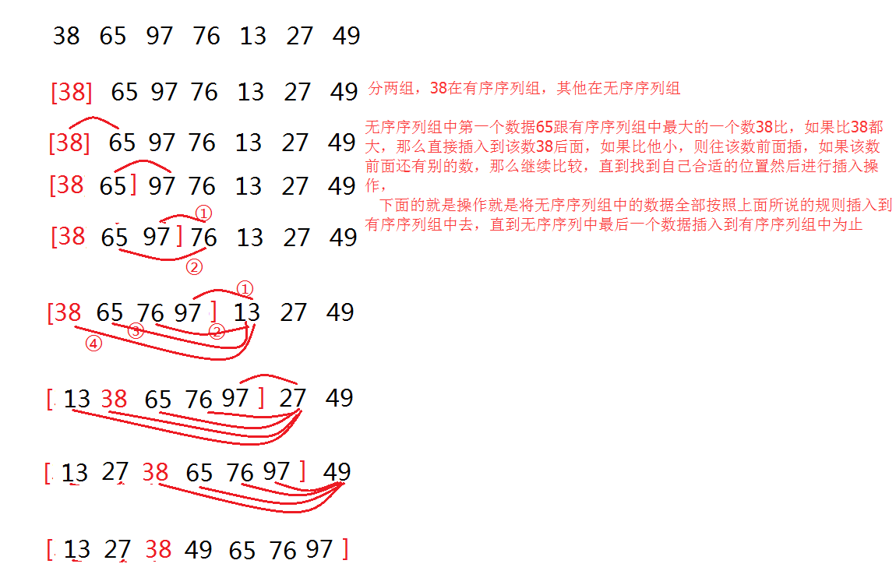

参考：[java实现7种排序算法](https://www.cnblogs.com/whgk/p/6596787.html)  
https://blog.csdn.net/liqinzhe11/article/details/78743743
# 一、文章编写风格总览
选择排序、插入排序、冒泡排序、归并排序、快速排序、希尔排序、堆排序、

最后对各种排序算法进行比较，理清楚各种排序的优缺点。　　

其中快速排序是冒泡排序的增强，堆排序是对选择排序的增强，希尔排序是对插入排序的增强，这就6种了，最后一种就是归并排序。


## 1. 选择排序


原理图如上所示：先将第一个位值上的数跟之后所有位置上的数依次进行比较，如果第一个位置上的数比第二个位置上的数大，则进行互换，然后继续将第一个位置上的数与第三个位置上的数进行比较，经过一轮的比较后，第一个位值上的数就是所有数中最小的一个，接着将第二个位置上的数与之后所有位置上的数进行比较，同样的规则，第二轮比较结束后，第二位放的就是所有数中第二小的数，依次往下比，直到最后一个位置结束。按照这种方法进行排序，就叫做选择排序。
```java
//选择排序 将数组从小到大排序
//选择排序，每一次从后面选择出一个最小的值（swap_pos），替换到前面来(i)。
//平均时间复杂度 O(n^2)
//最坏时间复杂度 O(n^2)
//最好时间复杂度 O(n^2)
//空间复杂度 O(1)
//我这个写法 是稳定排序
public void selectSort(int[] a){
    //第一层
    for(int i = 0;i<a.length;i++>){
        for(int j = i+1;j<a.length;j++){
            if(a[j]>a[i]){
                int temp = a[i];
                a[i] = a[j];
                a[j] = temp;
            }
        }
    }
}
```
## 2. 插入排序
简单，给定的一组记录，将其分为两个序列组，一个为有序序列(按照顺序从小到大或者从大到小)，一个为无序序列，初始时，将记录中的第一个数当成有序序列组中的一个数据，剩下其他所有数都当做是无序序列组中的数据。然后从无序序列组中的数据中(也就是从记录中的第二个数据开始)依次与有序序列中的记录进行比较，然后插入到有序序列组中合适的位置，直到无序序列组中的最后一个数据插入到有序序列组中为止。


```java
//从小到大排序
//插入排序
//平均时间复杂度:O(N^2)
//最坏情况复杂度:O(N^2)
//最好情况复杂度:O(N)
//空间复杂度:O(1)
//最多需要n(n−1)/2次比较
//最少需要n−1次比较
//稳定排序
public void insertSort(int[] a){
    int alen = a.length;
    int j,insertNum;
    for(int i=1;i<alen;i++){
        insertNum = a[i];
        if(a[i-1]>a[i]){//保证开始插入的前一个元素大于被插入元素 优化算法
            for(j=i-1;j>=0&&a[j]>insertNum;j--){
                a[j+1] = a[j];//当前元素向后移动一位
            }
            a[j+1]=insertNum;
        }
    }
}
```
## 3. 冒泡排序

冒泡排序跟选择排序一样的简单，好理解，整个过程就想气泡一样往上升，假设从小到大排序，对于给定的n个记录，从第一个记录开始依次对相邻的两个记录进行比较，当前面的记录大于后面的记录时，交换位置，进行一轮比较后，第n位上就是整个记录中最大的数，然后在对前n-1个记录进行第二轮比较，重复该过程直到进行比较的记录只剩下一个为止。


```java
//冒泡排序
//平均时间复杂度:O(N^2)
//最坏情况复杂度:O(N^2)
//空间复杂度:O(1)
//稳定排序
public static void  bubbleSort(int[] a){
        int temp;
        for(int i = 0;i<a.length;i++){
            for(int j = 0;j < a.length - 1 - i;j++){
                if(a[j]>a[j+1]){
                    temp = a[j];
                    a[j] = a[j+1];
                    a[j+1] = temp;
                }
            }
        }
    }
```
```java
//冒泡排序升级版1
//设置一个标记来标志一趟比较是否发生交换
//如果没有发生交换，则说明后面的数组已经有序
public static void  bubbleSort(int[] a){
        int temp;
        boolean flag = false;
        for(int i = 0;i<a.length;i++){
            for(int j = 0;j < a.length - 1 - i;j++){
                flag = false;
                if(a[j]>a[j+1]){
                    temp = a[j];
                    a[j] = a[j+1];
                    a[j+1] = temp;
                    flag = true;
                }
            }
            //如果没有发生交换，则说明后面的数组已经有序 第二层循环未交换数据
            if(flag == false){
                break;
            }
        }
    }
```

```java
//冒泡排序优化二
//用一个变量记录下最后一个发生交换的位置，后面没有发生交换的已经有序
//所以可以用这个值来作为下一次比较结束的位置
public static void  bubbleSort(int[] a){
        int temp;
        int n = a.length;
        int flag = n;
        int StopPos;
        for(int i = 0;i<n;i++){
            StopPos = flag - 1;
            for(int j = 0;j < StopPos;j++){
                flag = false;
                if(a[j]>a[j+1]){
                    temp = a[j];
                    a[j] = a[j+1];
                    a[j+1] = temp;
                    flag = j + 1;
                }
            }
        }
    }
```

## 4. 希尔排序
希尔排序是插入排序的进化版。
希尔排序其实是插入排序的升级版本，本质上进行的也是插入排序的操作，但是希尔排序并不是把一组记录看成一个整体，而将整个记录分为了若干组记录，然后在对每组记录进行插入排序，
1. 希尔排序具体步骤示例如下：
　　分组规则为如下所示：假设有 1 2 3 4 5  6 7 8 9 10 十个位置(每个位置上都会放数，这里忽略数，只讨论位置)。(省略了插入排序操作，只对如何分组进行讲解，而完整的希尔排序就是在每次分组完之后进行插入排序操作即可)

　　步长为：5、3、1
第一次分为5组记录(组数跟步长是一样的)：1,6 、2,7、3,8、 4,9、 5,10 这五组记录，分别对这五组记录进行插入排序。
第二次分为3组记录：1,4,7,10、2,5,8、3,6,9 这三组记录，分别对这三组记录进行插入排序
第三次分为1组记录：1 2 3 4 5 6  7 8 9 10， 为这组记录进行插入排序，
而步长只要满足最后一次为1，并且是从大到小即可。一般使用(数组长度/2) 或者 (数组长度/3 +1) 来代表步长。
这样做的好处是：
将待排序的数组元素分成多组，每组中记录数相对较少
经过前几次的排序后，整个序列变为了“基本有序序列”，**最后在对所有元素进行一次直接插入排序。**
直接插入排序对基本有序和记录数少的序列的效率是非常高的，而希尔排序就是利用了这两点。


解释：第一次分组，49,13、38,27、65,49、97,55、76,04  五组，对这五组分别进行插入排序，在49找到13时，就会进行插入排序，位置会进行互换，而并非先全部分组，后排序。

按照步长一直重复执行，直到步长为1后，执行完最后一次直接插入排序，整个希尔排序就完成了。　　　　

代码实现:
```java
//希尔排序
//最坏情况复杂度:O(N^2)
//不稳定排序
public static void  shellSort(int[] a) {
        int len = a.length;
        for(int increase = len/2;increase>0;increase /= 2){
            for(int i = increase;i<len;i++){
                int insertNum = a[i],j;
                for(j = i-increase;j>=0;j -= increase){
                    if(a[j]>insertNum){
                        a[j+increase] = a[j];//如果前面的大于后面的 向后移动increaseNum
                    }else{
                        break;
                    }
                }
                a[j+increase] = insertNum;
            }
        }
    }
```

## 5. 堆排序
上面说的希尔排序是对插入排序的增强，那么堆排序呢？
就是对选择排序进行增强，选择排序一个数据要跟每个数据都进行一次比较，并没有利用到一些比较的结果，比如，4 跟10比较，3跟4比较后，按理说不用让3跟10在比了，但是选择排序并没有这种智能化，而是老老实实的比较，而堆排序就完美的利用了前几次比较的结果，从而增加了效率。

讲解堆排序之前，必须要知道什么是堆？

**堆**是一颗完全二叉树，什么是完全二叉树？只有最下面的两层结点度能够小于2，并且最下面一层的结点都集中在该层最左边的若干位置的二叉树(设二叉树的深度为h，除第 h 层外，其它各层 (1～h-1) 的结点数都达到最大个数，第 h 层所有的结点都连续集中在最左边)


**堆分两种，大顶堆和小顶堆**
**大顶堆**：在完全二叉树的基础上，每个父节点都比自己的两个子结点大，这样的就是大顶堆，特点是根节点是最大的值，看下图，90比70,80大，70比60,10大，以此类推

**小顶堆**：和大顶堆相反，根节点是最小的值，并且每个父结点都比自己的子节点要小，如下图


堆排序就是利用堆的这种特点进行编写的
**原理**：先将一组拥有n个元素的序列构建成大顶堆或者小顶堆，再将根结点上的数跟堆最后一位数进行互换，此时，第n位的数就是整个序列中最大或者最小的数了，然后在将前n-1位元素进行构建成大顶堆或者小顶堆，在将根结点跟第n-1位进行互换，得到第2大或者第2小的数，在将前n-2位数进行构建，依次类推，直到只剩下1位元素即结束，排序完成。

通过讲解原理：堆排序分为三步
1、构建大顶堆或小顶堆
2、循环
根节点和末尾结点进行互换，
构建大顶堆或小顶堆　
3、排序完成

**5.1大话数据结构中的算法**
```java
//堆排序
//建堆的平均时间是：O(N)
//建堆的最坏情况是：O(NlogN)
//删除元素的时间是：O(logN)
//整个排序平均时间复杂度：O(N+NlogN)=O(NlogN)
//最坏情况复杂度：O(NlogN)
//不稳定排序
 /*
按照大顶堆和小顶堆这种特点，将一个无序的n个记录的序列构建成大顶堆,将根节点上的数与最后一个
结点n进行交换，然后在对n-1个记录进行构建大顶堆，继续把根节点与最后一个结点(n-1)互换，继续上面的操作。
从小到大排序，则使用大顶堆
从大到小排序，则使用小顶堆
本例：从小到大
*/
    public static void heapSort(int[] array) {
         //length为数组的长度，有几个数就是几，不要跟数组最大的下标值搞混淆了，有10
         //个数，length就是10，数组最大下标为9
        int length = array.length;    
        /*找到完全二叉树中的最后一个父结点(拥有子结点)的位置length/2，也就是最后一
        个父节点是在完全二叉树的第length/2的位置上，但是在数组中的位置是 (length/2)
        -1，它代表父节点在数组中的位置*/
        //第一步：将数组构建成一个大顶堆
        for (int i = length / 2 - 1; i >= 0; i--) {//依次遍历每一个父节点，比如最后一个父节点是4，那么它前面所有结点都是父节点，都需要进行构建
            adjustMaxHeap(array, i, length);    
            //无序序列，所以需要从下往上全部进行构建。该方法做的事情就是，比较找到父节点，和两个子节点中最大的数放置到父节点的位置上。
        }
        //第二步：构建好了大顶堆后，将第一个数与最后一个进行互换,互换后继续调整大顶堆，
        for (int i = length - 1; i > 0; i--) {
            //互换数据，提取出来了。互换数据后，就已经不在是大顶堆了，需要重新进行构
            wrap(array, 0, i);  
            //从上往下，因为基本上都已经有序了，没必要在从下往上重新进行构建堆了，这
            //就利用了前面比较的结果，减少了很多次比较。只进行一次构建即可完成构建大
            //顶堆 而上边的需要进行length / 2 - 1+1次      
            adjustMaxHeap(array, 0, i);    
        }
    }

    //交换数据
    private static void wrap(int[] array, int i, int j) {
        int temp = array[i];
        array[i] = array[j];
        array[j] = temp;
    }

    /**
     * 构建大顶堆的操作，
     * 父节点和其左右子节点的大小比较和互换，每次将父结点的位置和数组传进来，
     * 就能构建出大顶堆了。
     *
     * @param array  排序数组
     * @param s      当前所指父节点在数组中位置(下标)
     * @param length 数组的长度。用来判断父节点的两个子节点是否存在。
     *               父节点和左子结点的关系： 2s+1
     *               父结点和右子结点的关系： 2s+2
     */
    private static void adjustMaxHeap(int[] array, int s, int length) {
        int temp = array[s];
        int child;            //代表更大一方的子节点的数组下标
        //2s+1 是左子节点在数组中的位置，本来s+1是父节点在二叉树中的位置，2*(s+1) 是左子节点在二叉树中的位置，那么左子节点在数组中的位置为2*(s+1)-1，简化就为2s+1了
        //为什么需要这个for循环？很多人不理解，觉得这个方法里只需要找到父节点和两个子结点最大的一个即可，这是因为忽略了一个小问题，看下面到152行的解释应该就明白了。
        for (child = s * 2 + 1; child <= length - 1; child = child * 2 + 1) {    //child <= length-1 说明肯定有子节点，如果child=length-1，说明只有左结点

            if (child < length - 1 && array[child] < array[child + 1]) {//child<length-1，就说明肯定右子结点，将其进行比较，找出大的一方的数组下标
                child++;    //变成右子节点所在数组中的下标，找到那个较大的子节点
            }
            if (array[child] > temp) {    //将子节点(可能是左结点，也可能是右结点，就看上面这个判断了)与父节点进行比较，子节点大的话，将大的赋给父节点
                array[s] = array[child];
            } else {        //父节点大，什么也不做，跳出这层循环。
                break;
            }

            array[child] = temp;    //父结点变为最大时，要将原先的父节点的值给现在的子节点。
            s = child;        //因为子节点的值变了，那么就不知道这个子节点在他自己的两个子节点中是否还是最大，所以需要将该子节点的数组下标给s，去重新检测一遍。只有当父节点为最大时，才会执行break退出循环。

        }
    }
```
上述建堆的过程是，根据完全二叉树的性质，`i = length / 2 - 1`到0的所有节点均是非叶节点。
2s+1 是左子节点在数组中的位置，本来s+1是父节点在二叉树中的位置，2*(s+1) 是左子节点在二叉树中的位置，那么左子节点在数组中的位置为2*(s+1)-1，简化就为2s+1了
其中数组的下标是从0开始的，而二叉树是从1开始的，因此会有所不同。
**二叉树下标我定义：从上到下，从左到右，从1开始递增。**

**5.2第二种堆排序算法**
和第一种的方法中构建堆的方法不一样
```java
//堆排序
//建堆的平均时间是：O(N)
//建堆的最坏情况是：O(NlogN)
//删除元素的时间是：O(logN)
//整个排序平均时间复杂度：O(N+NlogN)=O(NlogN)
//最坏情况复杂度：O(NlogN)
//不稳定排序
 
//建立一个大顶堆O(n),要求就是 把最大的元素 移动到堆顶 也就是a[0]
void make_heap(vector<int>& a, int size) //size的当前堆的大小，也就是数组的前size个数
{
    for (int i = size - 1; i > 0; i--)
    {
        if (i % 2 && a[i] > a[(i - 1) / 2])//奇数
            swap(a[i], a[(i - 1) / 2]);
        else if (i % 2 == 0 && a[i] > a[(i - 2) / 2])//偶数
            swap(a[i], a[(i - 2) / 2]);
    }
}
void heapsort(vector<int>& a)
{
    int n = a.size();
    while (n)
    {
        make_heap(a, n); //每次把新的最大元素移到堆顶，也就是a[0]
        n--;
        swap(a[0], a[n]); //然后把当前最大移动到后面来作为排好序的元素
    }
}
```
这种做法做起来简单，但是不如第一种优化，建堆的过程是从最下面靠右，即最后一个开始建立，进行比较。但是时间复杂度会比第一种高。

# 6. 归并排序

1. **归并排序Merging Sort**：假如有n个记录，就拆分成n个序列，然后每次两个序列合并为一个，直至得到一个长度为n 的有序序列。


## 6.1 递归方法实现归并排序

**递归方法实现流程图**


MergeSort、MSort：
MSort函数就是先拆分，拆完了再排序组合

然后逐渐拆分为


Merge：
思路：让两个数组比较，小的放到有序数组中，通过计数器来让两个数组移动，最终把所有元素都放到有序数组中。m，n表示两个数组需比较的长度。

```java
public class mergeSort {
    public static int MAXSIZE;

    public static void main(String[] args) {
        int[] a = {62, 58, 88, 47, 73, 99, 35, 52, 93, 37};
        MAXSIZE = a.length;

        MergeSort(a, a, 0, a.length-1);
        utils.show(a);
    }

    // SR是固定的，TR用来存放结果，s是开始的位置，t是结束的位置
    public static void MergeSort(int[] SR, int[] TR, int s, int t){
        int m;
        // 存放被分段的内容
        int[] TR2 = new int[MAXSIZE];
        // 结束条件, s==t 无法再分
        if (s==t){
            TR[s] = SR[s];
        } else {
            m = (s + t) / 2;
            // 利用SR来赋值
            MergeSort(SR, TR2, s, m);
            MergeSort(SR, TR2, m+1, t);
            // 其实就算是TR2一直被保存
            MergeMethod(TR2, TR, s, m, t);
        }

    }

    // tr是存放的，sr是临时的
    public static void MergeMethod(int[] sr, int[] tr, int i, int m, int n) {

        // tr的起点
        int k = i;
        int j;
        // 两个判断条件
        for (j=m+1; j<=n && i<=m; k++){
            if (sr[j] < sr[i]){
                tr[k] = sr[j++];
            } else {
                tr[k] = sr[i++];
            }
        }
        // 检查两个数组是否还有剩余
        if (i <= m){
            for (int l=0; l<=m-i; l++){
                tr[k+l] = sr[i+l];
            }
        }

        if (j <= n){
            for (int l=0; l<=n-j; l++){
                tr[k+l] = sr[j+l];
            }
        }
    }
}

```
复杂度分析：
时间：需要将待排序序列中的所有记录扫描一遍，因此耗费O [ n ]时间，而由完全二叉树深度可知，整个归并排序需要进行[logn]次，所以总的时间复杂度为O[nlogn]。
空间：要开新栈空间存放，而且递归的栈空间深度为logn，因此总的空间复杂度为O[n+logn]。

总结：**比较占用内存，但效率高且稳定的算法。**

## 6.2 非递归方法实现归并排序

1. 归并排序有两种实现方式:一种是非递归的，一种是递归的，但是我觉得如果你理解了非递归的实现，那么你就知道了归并排序的原理，而递归的也就非常简单了。

2. 什么是归并排序呢？(我们讲解的是2路归并排序)

3. 一张图就可理解什么叫做2路归并排序


初始将一个数组中每个元素都看成一个有序序列(数组长度为n)，然后将相邻两个有序序列合并成一个有序序列，第一趟归并就可以得到n/2个长度为2(最后一个有序序列的长度可能是1，也可能不是，关键看数组中元素的个数了)的有序序列，再进行两两归并，得到n/4个长度为4的有序序列(最后一个的长度可能小于4)...一直这样归并下去，直到得到一个长度为n的有序序列

4. **归并排序步骤**
简单来说，通过三步，解决三个问题，就可以写出归并排序　　　　　　

1、**合并相邻两个有序序列**
解决相邻两个有序序列归并成一个有序序列，非常简单，新增一个数组(长度和需要排列的数组相同)，

二路归并的核心操作，在归并的过程中，可能会破坏原来的有序序列，所以，将归并的结果存入另外一个数组中，设两个相邻的有序序列为r[s]-r[m]和r[m+1]-r[t]，将这两个有序序列归并成一个有序序列，r1[s]-r1[t]，设三个参数i,j,k。 i和j分别指向两个有序序列的第一个记录，即i=s，j=m+1，k指向存放归并结果的位置(也就是将归并结果放到r1中的哪个位置)k=s。然后，比较i和j所指记录的数，取出较小者作为归并结果存入k所指的位置，然后将较小者的指向往后移动，直至两个有序序列之一的所有记录都取完，在将另一个有序序列的剩余记录顺序送到归并后的有序序列中(也就是放到r1中)
```java
    //一次归并
    /**
     *         相邻两个有序序列归并成一个有序序列的过程
     * @param r        原数组，需要归并的数组
     * @param r1    新数组，归并后的数组
     * @param s        两个有序序列的第一个有序序列的第一个元素的下标
     * @param m        两个有序序列的第一个有序序列的最后一个元素的下标
     * @param t        两个有序序列的第二个有序序列的最后一个元素的下标
     */
    public void merge(int[] r, int[] r1, int s, int m, int t){
        int i = s;    //两个有序序列的第一个有序序列的第一个元素的下标
        int j = m+1;    //两个有序序列的第二个有序序列的第一个元素的下标
        int k = s;        //新数组中的指向
        while(i <= m && j <= t){//两个有序序列都没有遍历完
            if(r[i] < r[j]){
                r1[k++] = r[i++];
            }else{
                r1[k++] = r[j++];
            }
        }
        //当其中一个序列遍历完之后，将剩下那个序列加到新数组中,判断是哪一个序列没有遍历完
        while(i <= m){
            r1[k++] = r[i++];
        }
        while(j<=t){
            r1[k++] = r[j++];
        }
    }
```

2. **如何完成一趟归并？**，一趟的意思是完成整个数组的所有2*(n/2)或4*(n/4)、...、或(n/2)*1的归并。

这里就需要分情况了，三种情况，

假设每个有序序列中的元素个数为h(第一次归并的h=1)，i=0，从第一个元素开始。归并每次取两个有序序列，那么跨度就是2h，问题就来了，只要知道长度为n(n为数组的最大下标值)的数组中有几个这样的两个有序序列，那么可以进行不同的操作了。

>**第一种情况**：(i+2*h-1) <= n  //比如，i=0，h=1时，(i+2*h-1)的意思就是指向了第一个 要归并的两个有序序列的最后一个位置的下标值，用它来跟n(n为数组最大的下标值)比较，如果小于n，那么说明后面还有别的数，如果等于n，说明到结尾了，整个数组正好全是两个有序序列得，不会有多余数。那么就执行一次归并，将这两个有序序列归并，然后i加2h。如果还符合这个条件，继续归并，如果不符合，判断别的情况。

 >**第二种情况**：(i+h-1) < n //说明最后还有两个有序序列，但是最后一个有序序列的长度不是h，同样将其进行归并

 >**第三种情况**: (i+h-1) >= n //说明只剩下最后一个有序序列，则直接将其有序序列送到r1的相应位置。

```java
    /**
     * 一趟归并排序
     * @param r    原数组，需要归并操作的数组
     * @param r1 新数组，归并好的数组
     * @param h 步长多少(有序序列中含有的元素个数)
     * @param n    数组长度(数组下标的最大值)
     */
    public void mergePass(int[] r, int[] r1, int h, int n){
        //判断根据步长能分成多个有序序列，
        int i = 0;
        while((i+2*h-1) <= n){//待归并的两个相邻有序序列的长度均为h,需要理解(i+2*h-1)的意思。
            merge(r,r1,i,i+h-1,i+2*h-1);//需要注意一次归并需要的参数
            i += 2*h;            
        }
        if(i+h-1 < n){//说明最后还有两个序列，第一个序列长度为h，第二个序列长度小于h
            merge(r,r1,i,i+h-1,n);
            i += 2*h;
        }else{//剩下最后一个序列，长度并且小于或等于h,不用归并了，直接放入新数组中
            for(; i<=n; i++){
                r1[i] = r[i];
            }
        }
    }
```
3. **完成整个归并排序**

前面我们解决了两个问题:一个是两个有序序列如何进行归并;一个是如何判断完成一趟归并过程。现在就需要解决如何控制二路归并的结束呢？也就是需要归并多少趟。

当步长等于n或者大于n时，说明只剩下一个有序序列了，那么即归并结束了。

```java
    //二分归并排序非递归算法
    //n：数组最大下标
    public void mergeSort(int[] r, int[] r1,int n){
        int h = 1;    //从1开始排序
        while(h<n){    //直到h>=n才结束，也就步长小于n时都要进行归并
            mergePass(r,r1,h,n);    //一趟归并
            h = 2*h;
            mergePass(r1,r,h,n);//因为经过一趟归并后，r1就变为了那个需要归并的数组，那么r就充当新数组，并且这也能够让排序好的数组放回到r数组中
            h = 2*h;            
        }
    }
```

**总结**：非递归的迭代方法，逼脸了递归时深度为log(n)的栈空间，空间只是用到用于申请归并临时用的r1[]数组，因此空间复杂度为O(n)，并且避免递归也在时间性能上有一定的提升。

**使用归并排序时，尽量考虑用非递归方法。**

# 7. 快速排序

## 1. 快速排序的基本思想：
    通过一趟排序将待排记录分割成独立的两部分，其中一部分记录的关键字比另一部分记录的关键字小，则可分别对这两部分记录进行排序。

　  快速排序是对冒泡排序的增强，增强得点在于：冒泡排序中，记录的比较和移动是在相邻两个位置进行的，记录每次交换只能后移一个位置，因而总的比较次数和移动次数较多，而快排记录的比较和移动是从两端向中间进行的，较大的记录一次就能从前面移动到后面，较小的记录一次就能从后面移动到前面，这样就减少了比较次数和移动次数

　　快速排序原理：选取一个轴值(比较的基准)，将待排序记录分为独立的两个部分，左侧记录都是小于或等于轴值，右侧记录都是大于或等于轴值，然后分别对左侧部分和右侧部分重复前面的过程，也就是左侧部分又选择一个轴值，又分为两个独立的部分，这就使用了递归了。到最后，整个序列就变得有序了。

问题：如何选择轴值？如何将序列变成左右两部分？ 

轴值的选择有三种：

>　1、选取序列的第一个位置上的记录

>　2、选择序列的中间位置上的记录

>**3、 将序列第一个位置 和 中间位置 和 末尾位置上的记录进行比较，选择大小居中的记录**
第三种比较合理，优化。

如何将序列划分成左右两部分？　　　　　　　　　

看图的执行流程，当一趟比较下来，轴值的左侧和右侧就被排好了，其中利用了first和end两个参数，一个从起点开始，一个从末尾开始，当两个相等时，就将序列中所有记录都遍历了一遍，第一次的比较次数是和选择排序第一次比较次数是一样的，但是之后就开始不一样了，因为在轴值的左侧的元素就不用跟轴值右侧的元素进行比较了，而选择排序还是跟所有的比。


```java
//对数组进行快速排序
//平均时间复杂度：O(NlogN)
//最坏情况复杂度：O(N^2)
//不稳定排序
public void qucikSort(int a[]){
    Qsort(a,1,a.length);
}

//
public void QSort(int a[],int low,int high){
    int pivot;//枢轴值
    if(low < high>){
        int pivot = Partition(a,low,high);
        QSort(a,low,pivot-1);
        Qsort(a,pivot+1,high);
    }
}

public int Partition(int a[],int low,int high){
    int pivotkey;
    pivotkey = a[low];//选取的枢轴值是第一个值。此处可以替换为三数取中或九数取中
    while(low<high>){
        while(low<high && a[high]>=pivot){
            high--;
        }    
        a[low] = a[high];//正常此处应该是交换a[low]和a[high]的值，只
        //不过此处进行了优化，避免了不必要的交换
        while(low<high && a[low]<=pivot){
            low++;
        }
        a[high] = a[low];
    }
    a[low] = pivot;
    return low;
}


```

Partition函数理解：先找一个值，记为枢轴，然后想办法对数组重排，让枢轴的左边都小于枢轴，枢轴的右边都大于枢轴，然后返回枢轴的位置，再用该位置划分数组为两部分，继续排序。

时间复杂度分析：
快排的时间性能取决于快速排序递归的深度，将数组转换成二叉树，如果递归是平衡的且第一个数是平衡树的根，那么此时性能较好。
最好 平均：O[nlogn]
最坏：O[n^2]
空间：O[logn]

## 2.快速排序优化
**1. 优化选取枢轴**
缺陷如果选择的pivotkey不是中位数，是个很极端的数的话，很容易浪费性能，做许多无用的比较。

三数取中法：取三个关键字进行排序，将中间数作为枢轴，一般是取左端、右端和中间三个数。

实现代码：
```java
int pivotkey;
int m = low + (high - low);
// 让左端最小
if (r[low] > r[high])
    swap(L, low, high);
// 让右端最大
if (r[m] > r[high])
    swap(L, m, low);
// 让左端最小
if (r[m] < [low])
    swap(L, m, low);

pivotkey = r[low];

```
**2. 优化小数组和递归操作**
小数组：大数组的时候使用，小数组的时候直接用插入排序。

递归：如果待排序的序列划分极端不平衡，递归深度趋近于n，此时不仅会**耗费很多栈空间**，速度也很慢，所以一个优化方向时使用尾递归见少递归次数。
```java
void QSort1(int a[], int low, int high)
{
    int pivot;
    if ((high-low) > MAX_LENGTH_INSERT_SORT)
    {
        // 用迭代代替了部分递归，缩减了堆栈深度
        while (low < high)
        {
            pivot = Partition1(L, low, high);
            QSort1(L, low, pivot-1);
            low = pivot+1;
        }
    }
    else
        // 小数组直接用插入
        InsertSort(a);

```

## 3. java实现快速排序
```java
public class quickSort {
    public static void main(String[] args) {
        int[] a = {62, 58, 88, 47, 73, 99, 35, 52, 93, 37};
        QSort1(a, 0, a.length-1);
        utils.show(a);
        System.out.println("----------------");
        int[] b = {62, 58, 88, 47, 73, 99, 35, 52, 93, 37};
        QSort2(b, 0, b.length-1);
        utils.show(b);
    }

    private static void QSort2(int[] a, int low, int high) {
        // 优化迭代
        while(low < high){
            // 让keyget2代替pivkey+1 到 high的部分
            int pivkey = keyget2(a, low, high);
            QSort2(a, low, pivkey-1);
            low = pivkey+1;
        }
    }


    private static int keyget2(int[] a, int low, int high) {
        // 优化枢轴的选择
        // 找中位数
        int m = (low + high) / 2;
        if (a[m] < a[low]){
            utils.swap(a, m, low);
        }
        if (a[high] < a[m]){
            // 此时high已经是最大的了
            utils.swap(a, m, high);
        }
        if (a[m] > a[low]){
            // 此时m是最小的了
            utils.swap(a, m, low);
        }

        // key这里用m还是有点不合适，m不会再变化了
        // 让low做中位数
        int key = a[low];
        // 优化不必要的交换
        while (low < high){
            // 此处应有=key，否则会陷入死循环
            while (a[high]>=key && low<high){
                high--;
            }
            a[low] = a[high];
            while (a[low]<=key && low<high){
                low++;
            }
            a[high] = a[low];
        }
        a[low] = key;
        return low;
    }


    private static void QSort1(int[] a, int low, int high) {
        if (low < high){
            // 获取枢轴位置
            int pivkey = keyget1(a, low, high);
            QSort1(a, low,pivkey-1);
            QSort1(a, pivkey+1, high);
        }
    }


    private static int keyget1(int[] a, int low, int high) {
        int key = a[low];
        // 不断交换
        while (low < high){
            // 别忘了在里面也要加上low和high的判断
            while (a[high]>key && low<high){
                high--;
            }
            utils.swap(a, low, high);
            while (a[low]<key && low<high){
                low++;
            }
            utils.swap(a, low, high);
        }
        return low;
    }
}
```

# 8. 稳定排序与不稳定排序

这几天笔试了好几次了，连续碰到一个关于常见排序算法稳定性判别的问题，往往还是多选，对于我以及和我一样拿不准的同学可不是一个能轻易下结论的题目，当然如果你笔试之前已经记住了数据结构书上哪些是稳定的，哪些不是稳定的，做起来应该可以轻松搞定。本文是针对老是记不住这个或者想真正明白到底为什么是稳定或者不稳定的人准备的。

首先，排序算法的稳定性大家应该都知道，通俗地讲就是能保证排序前2个相等的数其在序列的前后位置顺序和排序后它们两个的前后位置顺序相同。在简单形式化一下，如果Ai = Aj，Ai原来在位置前，排序后Ai还是要在Aj位置前。

其次，说一下稳定性的好处。排序算法如果是稳定的，那么从一个键上排序，然后再从另一个键上排序，第一个键排序的结果可以为第二个键排序所用。基数排序就是这样，先按低位排序，逐次按高位排序，低位相同的元素其顺序再高位也相同时是不会改变的。另外，如果排序算法稳定，对基于比较的排序算法而言，元素交换的次数可能会少一些（个人感觉，没有证实）。

回到主题，现在分析一下常见的排序算法的稳定性，每个都给出简单的理由。

## 8.1 冒泡排序

冒泡排序就是把小的元素往前调或者把大的元素往后调。比较是相邻的两个元素比较，交换也发生在这两个元素之间。所以，如果两个元素相等，我想你是不会再无聊地把他们俩交换一下的；如果两个相等的元素没有相邻，那么即使通过前面的两两交换把两个相邻起来，这时候也不会交换，所以相同元素的前后顺序并没有改变，所以冒泡排序是一种稳定排序算法。

## 8.2 选择排序

选择排序是给每个位置选择当前元素最小的，比如给第一个位置选择最小的，在剩余元素里面给第二个元素选择第二小的，依次类推，直到第n - 1个元素，第n个元素不用选择了，因为只剩下它一个最大的元素了。那么，在一趟选择，如果当前元素比一个元素小，而该小的元素又出现在一个和当前元素相等的元素后面，那么交换后稳定性就被破坏了。比较拗口，举个例子，序列5 8 5 2 9，我们知道第一遍选择第1个元素5会和2交换，那么原序列中2个5的相对前后顺序就被破坏了，所以选择排序不是一个稳定的排序算法。

## 8.3 插入排序
插入排序是在一个已经有序的小序列的基础上，一次插入一个元素。当然，刚开始这个有序的小序列只有1个元素，就是第一个元素。比较是从有序序列的末尾开始，也就是想要插入的元素和已经有序的最大者开始比起，如果比它大则直接插入在其后面，否则一直往前找直到找到它该插入的位置。如果碰见一个和插入元素相等的，那么插入元素把想插入的元素放在相等元素的后面。所以，相等元素的前后顺序没有改变，从原无序序列出去的顺序就是排好序后的顺序，所以插入排序是稳定的。

## 8..4 快速排序
快速排序有两个方向，左边的i下标一直往右走，当a[i] <= a[center_index]，其中center_index是中枢元素的数组下标，一般取为数组第0个元素。而右边的j下标一直往左走，当a[j] > a[center_index]。如果i和j都走不动了，i <= j，交换a[i]和a[j],重复上面的过程，直到i > j。 交换a[j]和a[center_index]，完成一趟快速排序。在中枢元素和a[j]交换的时候，很有可能把前面的元素的稳定性打乱，比如序列为5 3 3 4 3 8 9 10 11，现在中枢元素5和3（第5个元素，下标从1开始计）交换就会把元素3的稳定性打乱，所以快速排序是一个不稳定的排序算法，不稳定发生在中枢元素和a[j] 交换的时刻。

## 8.5 归并排序
归并排序是把序列递归地分成短序列，递归出口是短序列只有1个元素（认为直接有序）或者2个序列（1次比较和交换），然后把各个有序的段序列合并成一个有序的长序列，不断合并直到原序列全部排好序。可以发现，在1个或2个元素时，1个元素不会交换，2个元素如果大小相等也没有人故意交换，这不会破坏稳定性。那么，在短的有序序列合并的过程中，稳定是是否受到破坏？没有，合并过程中我们可以保证如果两个当前元素相等时，我们把处在前面的序列的元素保存在结果序列的前面，这样就保证了稳定性。所以，归并排序也是稳定的排序算法。

## 8.6 基数排序
基数排序是按照低位先排序，然后收集；再按照高位排序，然后再收集；依次类推，直到最高位。有时候有些属性是有优先级顺序的，先按低优先级排序，再按高优先级排序，最后的次序就是高优先级高的在前，高优先级相同的低优先级高的在前。基数排序基于分别排序，分别收集，所以其是稳定的排序算法。

## 8.7 希尔排序(shell)
希尔排序是按照不同步长对元素进行插入排序，当刚开始元素很无序的时候，步长最大，所以插入排序的元素个数很少，速度很快；当元素基本有序了，步长很小， 插入排序对于有序的序列效率很高。所以，希尔排序的时间复杂度会比O(n^2)好一些。由于多次插入排序，我们知道一次插入排序是稳定的，不会改变相同元素的相对顺序，但在不同的插入排序过程中，相同的元素可能在各自的插入排序中移动，最后其稳定性就会被打乱，所以shell排序是不稳定的。

## 8.8 堆排序
我们知道堆的结构是节点i的孩子为2 * i和2 * i + 1节点，大顶堆要求父节点大于等于其2个子节点，小顶堆要求父节点小于等于其2个子节点。在一个长为n 的序列，堆排序的过程是从第n / 2开始和其子节点共3个值选择最大（大顶堆）或者最小（小顶堆），这3个元素之间的选择当然不会破坏稳定性。但当为n / 2 - 1， n / 2 - 2， ... 1这些个父节点选择元素时，就会破坏稳定性。有可能第n / 2个父节点交换把后面一个元素交换过去了，而第n / 2 - 1个父节点把后面一个相同的元素没 有交换，那么这2个相同的元素之间的稳定性就被破坏了。所以，堆排序不是稳定的排序算法。

综上，得出结论: 选择排序、快速排序、希尔排序、堆排序不是稳定的排序算法，而冒泡排序、插入排序、归并排序和基数排序是稳定的排序算法

# 9. 几种排序应用场景
1. 注意，排序的稳定性的意思是：举例说明。
排序前：5,6（1）,1,4,3,6（2）,（第一个6在第二个6之前）
排序后：如果排序后的结果是1,2,3,4,5,6（1），6（2）那么就说此排序算 法是稳定的，反之为不稳定
2. 当待排序记录个数n较大，并且是无序序列，对稳定性不作要求时，采用快速排序为宜
3. 当待排序记录个数n较大，内存空间允许，要求排序稳定时，采用归并排序为宜
4. 当待排序记录个数n较大，且序列中可能出现正序或逆序的情况，不要求稳定性，采用堆排序或归并排序为宜
5. 当待排序的个数n较少 且基本有序时，使用基本排序 冒泡 插入 选择排序均可