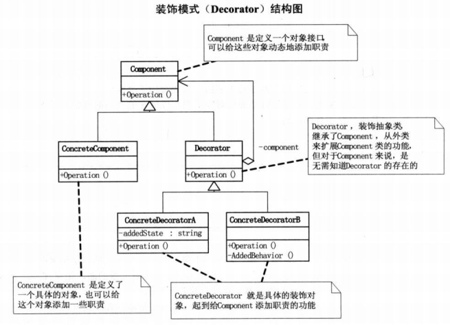
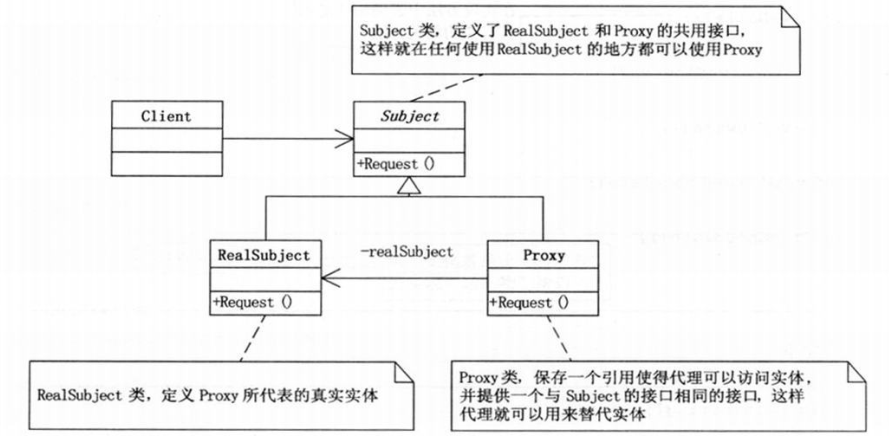

##  1. 设计模式原则 

###  1. 单一职责原则
1 **单一职责原则**：就一个类而言，应该仅有一个引起它变化的原因。  
2 软件设计真正要做的许多内容，就是发现职责并把那些职责相互分离。如果想要改变一个类，那个这个类就具有多余一个职责。

###  2. 开放封闭原则
1 **开放-封闭原则**：扩展开放 修改封闭
2 开发人员应该仅对程序中呈现频繁变换的那些对象作出抽象，而对于每个部分刻意作出抽象不是好主意。
因此拒绝不成熟的抽象同样重要

###  3. 依赖倒转原则
>1. **依赖倒转原则**：
 >>高层模块不应该依赖于低层模块。两个都应该依赖于抽象
 >>抽象不应该依赖细节，细节应该依赖于抽象。说白了就是要面向接口编程，不要对实现编程
 2. 不管高层模块还是低层模块，他们都依赖于抽象，具体就是抽象类或者接口类，只要接口稳定，任何一个更改都不用担心其他的受到影响，使得无论高层模块还是低层模块，都不容易受到影响。    
3. 谁也不依靠谁，除了约定的接口，大家都灵活自如。

### 1.4 李氏代换原则
1. **李氏代换原则**：子类型必须能够替换掉它的父类型
2. 一个软件实体如果使用的是一个父类的话，那么一定使用于其他子类，而且察觉不到父类对象和子类对象的区别。即，在软件里，将父类对象替换为其子类，程序行为没有变化。

***

## 2. 简单工厂方模式

***
## 3. 装饰模式
1. 和建造者模式的区别：建造者模式要求建造的过程必须是稳定的，即顺序什么的都是固定的。但是装饰模式不是，过程不必稳定，有多种方案。
2. **装饰模式**：动态的给一个对象添加一些额外的职责，就增加功能来说，装饰模式比生成子类更为灵活。（即用装饰模式代替继承）

图中可以看到：<kbd>Commponent</kbd>是一个对象接口，可以给这些对象动态的添加职责。ConcreteComponent是定义了一个具体的对象，也可以给这个对象添加职责。Decorator装饰抽象类，继承了Component，从外类来扩展Component类的功能，但对于Component来说，无需知道Decorator的存在。ConcreteDecorator就是具体的装饰对象，起到给Component添加职责的功能。

```C++
#include <iostream>
#include <string>

//person 类
class Person
{
public:
	Person() {};
	Person(std::string name);
	virtual void Show();
	//当你用一个基类指针或引用指向一个继承类对象的时候，
	//调用一个虚函数时, 实际调用的是继承类的版本。
private:
	std::string name;
};

Person::Person(std::string name)
{
	this->name = name;
}

void Person::Show() 
{
    //父类的函数
    std::cout << "装饰的" << name << std::endl;

}

//装饰类
//负责穿戴不同的服装 有一个参数是服装对象
class Finery :public Person {
protected:
	Person* component;
public:
	Finery() {};
    void Decorator(Person* component);//穿衣服函数
	void Show();
};

 void Finery::Decorator(Person* component) {
	this->component = component;
}
 void Finery::Show() 
 {
	//子类的函数
	if (component != NULL)
	       component->Show();

}
 //具体服装
 class Tshirts :public Finery {
public:
	Tshirts() {};
	void Show() 
	{
		std::cout << "T shirts";
		Finery::Show();
	}
};

class Sneakers :public Finery {
public:
	Sneakers() {};
	void Show() 
	{
		std::cout << " Sneakers";
		Finery::Show();	
	}
};

void main() {
    Person* xc = new Person("小菜");
	std::cout << "first style:" << std::endl;
    Tshirts* ts = new Tshirts();
	Sneakers* sn = new Sneakers();
	ts->Decorator(xc);//小菜穿第一件衣服
	sn->Decorator(ts);//小菜穿第二件衣服
	sn->Show();		
	system("pause");
}
```
>  1. 上述例子中，执行的过程如下：首先有一个超类Person，然后装饰类Finery继承Person，同时Tshirt和Snakers都继承Finery，当然也是person的子类。
>  2. person中定义了虚函数，在java中时抽象方法，即**当你用一个基类指针或引用指向一个继承类对象的时候，调用一个虚函数时, 实际调用的是继承类的版本**，这是多态。所以`ts->Decorator(xc)`该函数，是指Tshirt对象，存储的是<kdb>Person*</kbd>类型的component，当其调用show的时候，直接调用Person类的`show()`方法。`sn->Decorator(ts)`方法，将Snakers的sn对象，存储<kdb>指向Tshirt的Person的引用</kbd>类型的component。
>  3. 当我们接下来调用`sn->Show()`的时候，其内部调用`Finery::Show()`方法，其内部判断执行`component->Show()`，因为sn对象的component是Tshirt类型，又因为`show()`是抽象方法，由于多态进而执行Thsirt的`show()`方法，所以接下来，因为进入了tshirt对象中，所以`component->Show()`方法中的component是上一步中存储的person*，因此去执行person的show方法。
这就是装饰模式的嵌套循环

```java
public abstract class Component {
    public abstract void operation();
}
```
```java
public class ConcreteComponent extends Component {

    @Override
    public void operation() {
	System.out.println("具体对象的操作");
    }

}
```
```java
public abstract class Decorator extends Component {
    protected Component component;

    public Component getComponent() {
	return component;
    }

    public void setComponent(Component component) {
	this.component = component;
    }

    @Override
    public void operation() {
	if (component != null) {
	    component.operation();
	}
    }

}

class ConcreteDecoratorA extends Decorator {
    private String addedState;

    @Override
    public void operation() {
	// 首先运行原Component的operation()，再执行本类的功能，如addedState，相当于对原Component进行了装饰
	super.operation();
	addedState = "A中的new state ";
	System.out.println(addedState + "具体装饰对象A的操作");
    }
}

class ConcreteDecoratorB extends Decorator {
    @Override
    public void operation() {
	super.operation();
	addedBehavior();
	System.out.println("具体装饰对象B的操作");
    }

    public void addedBehavior() {
	System.out.print("B中的新增行为 ");
    }
}

class ConcreteDecoratorC extends Decorator {
    @Override
    public void operation() {
	super.operation();
	System.out.println("C没有特殊行为 " + "具体装饰对象C的操作");
    }

}
```
```java
public class DecoratorClient {
    public static void main(String[] args) {
	ConcreteComponent concreteComponent = new ConcreteComponent();
	ConcreteDecoratorA concreteDecoratorA = new ConcreteDecoratorA();
	ConcreteDecoratorB concreteDecoratorB = new ConcreteDecoratorB();
	ConcreteDecoratorC concreteDecoratorC = new ConcreteDecoratorC();

	concreteDecoratorA.setComponent(concreteComponent);
	concreteDecoratorB.setComponent(concreteDecoratorA);
	concreteDecoratorC.setComponent(concreteDecoratorB);
	concreteDecoratorC.operation();

    }
}
```

3. 如果只有一个ConcreteComponent类而没有抽象的Component类，那么Decorator类可以是ConcreteComponent的一个子类；同样，如果只有一个ConcreteDecorator类，那么就没有必要见一个单独的Decorator类，可以吧二者结合为一个类。

4. **总结装饰模式**
    装饰模式是为已有功能动态添加更多功能的一种方式。
	是为了满足一些只在某种特定情况下才有的特殊的行为。
**优点是：** 
>把类中的装饰功能从类中剔除，这样可以简化该类。
>有效的把类的核心职责和装饰功能区分开来。避免了用很多子类进行层层继承

***

## 4. 为别人做嫁衣——代理模式

1. **代理模式**：为其他对象提供一种代理以控制对这个对象的访问。
2.代理模式结构图 ：

```java
public abstract class Subject{
	public abstract void Request();
}

public class RealSubject：Subject{
	@override
	public void Request(){
		System.out.printl("真实的请求");
	}
}

public class Proxy：Subject{
	public RealSubject realSubject;
	@override
	public void Request(){
		if(RealSubject==null)
		{
			realSubject = new RealSubject();
		}
		realSubject.Request();
	}
}

public class ProxyClient{
	Proxy proxy = new Proxy();
	proxy.request();
}
```

### 1. 代理模式应用的场合
1 远程代理